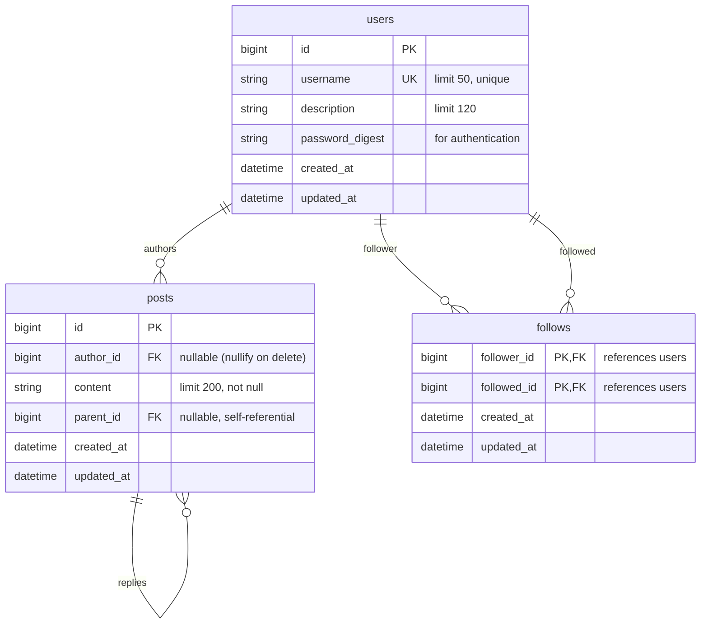

# Microblogging Application - Implementation Plan

## Database Architecture

### Entity Relationship Diagram



### Database Relationships

1. **Users → Posts** (One-to-Many)
   - A user can have many posts
   - When a user is deleted, their posts' `author_id` is set to `NULL` (cascade: nullify)
   - Posts from deleted users remain visible but show as "deleted user"

2. **Users → Follows** (Many-to-Many, Self-Referential)
   - Users can follow other users (one-way relationship)
   - Composite primary key: `(follower_id, followed_id)`
   - Cascade delete: if user is deleted, all their follow relationships are deleted
   - Cannot follow yourself (business logic validation)

3. **Posts → Posts** (Self-Referential, One-to-Many)
   - Posts can have replies (via `parent_id`)
   - When a parent post is deleted, replies' `parent_id` is set to `NULL`
   - Supports nested conversations

---

## Implementation Plan

### Phase 1: Core Setup & Authentication

#### 1.1 Dependencies Setup
- [ ] Uncomment and add `bcrypt` gem to Gemfile for password hashing
- [ ] Run `bundle install`

#### 1.2 Database Migrations
- [ ] Create `CreateUsers` migration
  - `username` (string, limit: 50, unique, not null)
  - `description` (string, limit: 120, nullable)
  - `password_digest` (string, not null) - for authentication
  - Timestamps
  - Add unique index on `username`

- [ ] Create `CreatePosts` migration
  - `author_id` (bigint, foreign key to users, nullable)
  - `content` (string, limit: 200, not null)
  - `parent_id` (bigint, foreign key to posts, nullable) - for replies
  - Timestamps
  - Add indexes: `author_id`, `created_at`, `parent_id`
  - Foreign key to users with `on_delete: :nullify`
  - Foreign key to posts (self-referential) with `on_delete: :nullify`

- [ ] Create `CreateFollows` migration
  - `follower_id` (bigint, foreign key to users, not null)
  - `followed_id` (bigint, foreign key to users, not null)
  - Timestamps
  - Composite primary key: `[:follower_id, :followed_id]`
  - Add unique index on `[follower_id, followed_id]`
  - Add index on `followed_id` (for queries like "who follows this user?")
  - Foreign keys to users with `on_delete: :cascade` (both directions)
  - Add check constraint to prevent self-following (optional, or handle in model)

#### 1.3 Models
- [ ] Create `User` model (`app/models/user.rb`)
  - `has_secure_password` (for authentication)
  - `has_many :posts, foreign_key: 'author_id', dependent: :nullify`
  - `has_many :active_follows, class_name: 'Follow', foreign_key: 'follower_id', dependent: :destroy`
  - `has_many :passive_follows, class_name: 'Follow', foreign_key: 'followed_id', dependent: :destroy`
  - `has_many :following, through: :active_follows, source: :followed`
  - `has_many :followers, through: :passive_follows, source: :follower`
  - Validations:
    - `username`: presence, uniqueness, length (max 50)
    - `description`: length (max 120), allow_nil
    - `password`: presence (on create), length (minimum 6-8 chars)
  - Methods:
    - `follow(other_user)` - create follow relationship
    - `unfollow(other_user)` - destroy follow relationship
    - `following?(other_user)` - check if following
    - `feed_posts` - scope to get posts from user and following users

- [ ] Create `Post` model (`app/models/post.rb`)
  - `belongs_to :author, class_name: 'User', optional: true`
  - `belongs_to :parent, class_name: 'Post', optional: true`
  - `has_many :replies, class_name: 'Post', foreign_key: 'parent_id', dependent: :nullify`
  - Validations:
    - `content`: presence, length (maximum 200 characters)
    - Cannot reply to a reply (business logic - only one level of nesting, or allow unlimited)
  - Scopes:
    - `timeline` - ordered by `created_at DESC`
    - `top_level` - where `parent_id IS NULL`
    - `replies` - where `parent_id IS NOT NULL`
  - Methods:
    - `reply?` - check if post is a reply
    - `author_name` - returns author username or "Deleted User"

- [ ] Create `Follow` model (`app/models/follow.rb`)
  - `belongs_to :follower, class_name: 'User'`
  - `belongs_to :followed, class_name: 'User'`
  - Validations:
    - Uniqueness of `[follower_id, followed_id]`
    - Cannot follow yourself (`follower_id != followed_id`)
  - Note: Composite primary key handled by database, Rails may need additional setup

#### 1.4 Authentication System
- [ ] Create `SessionsController` (`app/controllers/sessions_controller.rb`)
  - Actions: `new`, `create`, `destroy`
  - Login logic using `authenticate` method from `has_secure_password`

- [ ] Create `UsersController` (`app/controllers/users_controller.rb`)
  - Actions: `new`, `create`, `show`, `edit`, `update`, `destroy`
  - `create`: sign up new user
  - `show`: public profile (username, description, posts)
  - `edit`/`update`: update password and description (require authentication)
  - `destroy`: delete account (require authentication, confirmation)

- [ ] Add authentication helpers to `ApplicationController`
  - `current_user` method (from session)
  - `logged_in?` method
  - `require_login` before_action filter

- [ ] Create session management
  - Store user_id in session
  - Handle login/logout

---

### Phase 2: Posts Functionality

#### 2.1 Posts Controller
- [ ] Create `PostsController` (`app/controllers/posts_controller.rb`)
  - Actions: `index`, `create`, `show`
  - `index`: timeline view (own posts + posts from followed users)
    - Filter: all posts, my posts, following posts
  - `create`: create new post (require authentication)
    - Validates content length (max 200 chars)
  - `show`: individual post view with replies
    - Display post and all replies in chronological order

#### 2.2 Posts Views
- [ ] Create posts views (`app/views/posts/`)
  - `index.html.erb`: Timeline feed
    - Post creation form (if logged in)
    - List of posts (chronological, newest first)
    - Show author, content, timestamp
    - Reply button/link for each post
  - `show.html.erb`: Single post view
    - Original post
    - Reply form (if logged in)
    - List of replies below
  - Partials:
    - `_post.html.erb`: Individual post display
    - `_post_form.html.erb`: Form for creating posts/replies

---

### Phase 3: Following System

#### 3.1 Follows Controller
- [ ] Create `FollowsController` (`app/controllers/follows_controller.rb`)
  - Actions: `create`, `destroy`
  - `create`: follow a user (require authentication)
  - `destroy`: unfollow a user (require authentication)
  - Prevent self-following
  - Handle duplicate follow attempts gracefully

#### 3.2 User Profile Enhancements
- [ ] Update `UsersController#show` view
  - Display user stats: post count, follower count, following count
  - Follow/Unfollow button (if viewing other user's profile)
  - List of user's posts (or top-level posts only?)

#### 3.3 Timeline Logic
- [ ] Implement feed query in `Post` model
  - Scope that returns posts from current user and followed users
  - Optimize with proper joins and indexes
  - Consider pagination for large feeds

---

### Phase 4: User Settings & Account Management

#### 4.1 Settings Views
- [ ] Create settings view (`app/views/users/edit.html.erb`)
  - Form to update password (with confirmation)
  - Form to update description
  - Delete account button (with confirmation modal/page)

#### 4.2 Account Deletion
- [ ] Implement `UsersController#destroy`
  - Verify password before deletion (security)
  - Handle cascade: posts remain with nullified `author_id`
  - Logout user after deletion
  - Redirect to home page with flash message

---

### Phase 5: Routes & Navigation

#### 5.1 Routes Configuration
- [ ] Update `config/routes.rb`:
  ```ruby
  root 'posts#index'

  # Authentication
  get '/login', to: 'sessions#new'
  post '/login', to: 'sessions#create'
  delete '/logout', to: 'sessions#destroy'

  # Sign up
  get '/signup', to: 'users#new'
  post '/signup', to: 'users#create'

  # Posts
  resources :posts, only: [:index, :show, :create]

  # Users
  resources :users, only: [:show, :edit, :update, :destroy] do
    member do
      get :edit
    end
  end

  # Following
  resources :follows, only: [:create, :destroy]

  # Settings
  get '/settings', to: 'users#edit'
  ```

#### 5.2 Navigation & Layout
- [ ] Update `app/views/layouts/application.html.erb`
  - Navigation bar with:
    - Logo/Home link
    - Timeline link (if logged in)
    - Profile link (if logged in)
    - Settings link (if logged in)
    - Login/Signup links (if not logged in)
    - Logout link (if logged in)
  - Display current username when logged in
  - Flash messages display area

---

### Phase 6: UI/UX Polish

#### 6.1 Styling
- [ ] Create/update `app/assets/stylesheets/application.css`
  - Modern, clean design for microblog
  - Responsive layout
  - Post cards/containers
  - Form styling
  - Navigation styling
  - Button styles (follow, reply, delete, etc.)

#### 6.2 User Experience
- [ ] Character counter for post content (200 char limit)
- [ ] Confirmation modals for destructive actions (delete account, unfollow)
- [ ] Flash messages for success/error feedback
- [ ] Loading states for async actions (if using Turbo/Hotwire)
- [ ] Empty states (no posts, not following anyone, etc.)

#### 6.3 Turbo/Hotwire Integration (Optional Enhancement)
- [ ] Use Turbo Frames for post creation (no page reload)
- [ ] Use Turbo Streams for real-time updates (if adding Action Cable later)
- [ ] Stimulus controllers for interactive elements (character counter, modals)

---

### Phase 7: Testing & Validation

#### 7.1 Model Tests
- [ ] Test User model validations
- [ ] Test Post model validations and associations
- [ ] Test Follow model validations (no self-following)
- [ ] Test User follow/unfollow methods
- [ ] Test Post feed scope logic

#### 7.2 Controller Tests
- [ ] Test authentication flows (login, logout, signup)
- [ ] Test post creation (authorized and unauthorized)
- [ ] Test follow/unfollow actions
- [ ] Test account deletion
- [ ] Test authorization (can't access others' settings)

#### 7.3 Integration Tests
- [ ] Test complete user journey: signup → login → post → follow → view timeline
- [ ] Test reply functionality
- [ ] Test account deletion flow

---

### Phase 8: Edge Cases & Security

#### 8.1 Security Considerations
- [ ] Prevent CSRF attacks (Rails default, verify enabled)
- [ ] Sanitize user input (prevent XSS in posts)
- [ ] Rate limiting for post creation (optional)
- [ ] Password strength requirements
- [ ] Session security (secure, http-only cookies)

#### 8.2 Edge Cases
- [ ] Handle deleted users in post display
- [ ] Handle orphaned posts (author deleted)
- [ ] Prevent duplicate follows
- [ ] Handle concurrent follow/unfollow requests
- [ ] Pagination for large feeds (kaminari or pagy gem)

---

## Development Order Recommendation

### Sprint 1: Foundation (Phases 1-2)
1. Setup dependencies (bcrypt)
2. Create migrations and models
3. Basic authentication (signup, login, logout)
4. Post creation and display
5. Basic timeline view

### Sprint 2: Core Features (Phase 3)
1. Following system
2. Enhanced timeline (following users' posts)
3. User profiles

### Sprint 3: Replies & Settings (Phase 4)
1. Reply functionality
2. User settings (password, description)
3. Account deletion

### Sprint 4: Polish (Phases 5-6)
1. Navigation and routes
2. UI/UX improvements
3. Styling

### Sprint 5: Quality (Phases 7-8)
1. Testing
2. Security hardening
3. Edge case handling
4. Performance optimization

---

## Database Notes

### Missing from Schema (to add)
- `password_digest` field in `users` table for authentication

### Schema Compliance Checklist
- ✅ `users.username`: limit 50, unique, not null
- ✅ `users.description`: limit 120, nullable
- ✅ `posts.content`: limit 200, not null
- ✅ `posts.author_id`: nullable, nullify on delete
- ✅ `posts.parent_id`: nullable, nullify on delete (for replies)
- ✅ `follows`: composite primary key, cascade delete
- ✅ Proper indexes on foreign keys and frequently queried fields
- ⚠️ Need to add `password_digest` to users table

---

## Technology Stack

- **Framework**: Rails 8.1.1
- **Database**: SQLite3 (development/test)
- **Authentication**: `has_secure_password` (bcrypt)
- **Frontend**: ERB templates, Turbo, Stimulus
- **Styling**: CSS (consider Tailwind CSS for faster styling)
- **Testing**: Minitest (Rails default)

---

## Additional Considerations

### Future Enhancements (Out of Scope)
- Email notifications for new followers/replies
- Search functionality
- Post media/images
- Hashtags and mentions
- Activity feed
- Block/mute users
- Analytics dashboard

### Performance Optimizations
- Add database indexes for frequently queried fields
- Consider pagination early (kaminari or pagy gem)
- Optimize N+1 queries in timeline view
- Cache follower/following counts
- Consider read replicas for production scale

---

## Next Steps

1. Review this plan
2. Start with Phase 1: Core Setup & Authentication
3. Create migrations matching the provided schema
4. Build models with proper associations and validations
5. Implement authentication system
6. Progress through remaining phases iteratively

