# 🚀 Building a Scalable Microblog: From Zero to Production-Ready

> **A journey through performance optimization, architectural decisions, and scaling strategies that transformed a simple Rails app into a system capable of handling millions of users.**

---

## The Challenge: Building Twitter at Scale

Picture this: You're tasked with building a microblogging platform (think Twitter/X) that needs to handle:

- **1 million+ users**
- **50 million+ follow relationships**
- **Fast response times** (<200ms for feed queries)
- **High concurrency** (100+ requests/second)
- **Real-time updates**

But here's the kicker: **You start with a simple Rails app that barely handles 10 users.** 😅

This is the story of how we transformed that simple app into a production-ready, scalable system through systematic optimization, architectural decisions, and a deep understanding of performance bottlenecks.

---

## Table of Contents

1. [The Beginning: A Simple Rails App](#the-beginning-a-simple-rails-app)
2. [The First Bottleneck: Database Queries](#the-first-bottleneck-database-queries)
3. [The Big O Revelation: Understanding Query Complexity](#the-big-o-revelation-understanding-query-complexity)
4. [The Optimization Journey](#the-optimization-journey)
5. [The Game Changer: Fan-Out on Write](#the-game-changer-fan-out-on-write)
6. [Scaling Horizontally: From One Server to Many](#scaling-horizontally-from-one-server-to-many)
7. [The Numbers: Performance Metrics](#the-numbers-performance-metrics)
8. [Lessons Learned](#lessons-learned)
9. [What's Next?](#whats-next)

---

## The Beginning: A Simple Rails App

### Initial Architecture

We started with a classic Rails monolith:

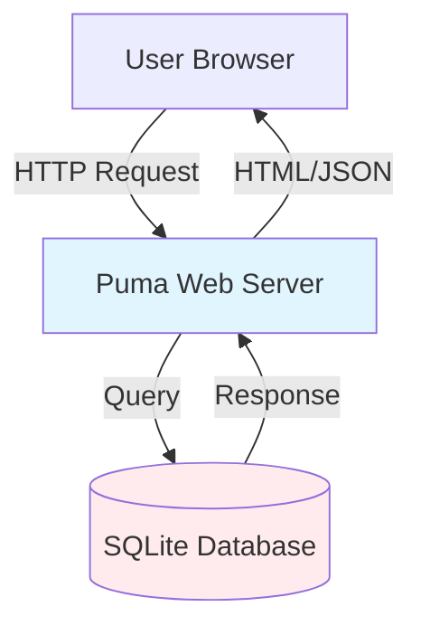

**Initial Stack:**
- Ruby on Rails 8.1
- SQLite database (for simplicity)
- Puma web server (5 threads)
- Basic authentication
- Simple MVC structure

### The Data Model

Our core entities were straightforward:

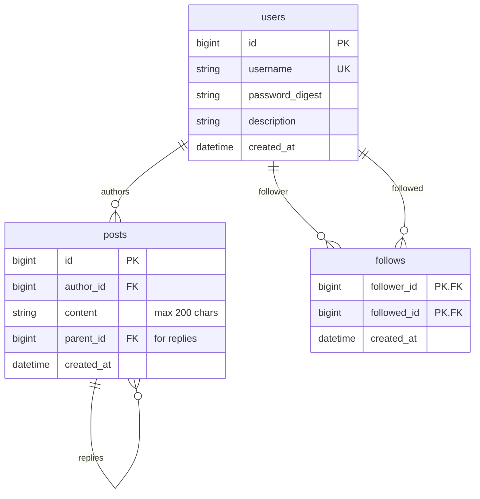

**The Problem:** This worked great for 10 users. But when we tested with 1,000 users, everything slowed down. Feed queries took 500ms+. Pages timed out. We had a scalability problem.

---

## The First Bottleneck: Database Queries

### The Feed Query Problem

The most critical operation in a microblog is **loading a user's feed**. Here's what we started with:

```ruby
# app/models/user.rb (Initial Version)
def feed_posts
  following_ids = following.pluck(:id)
  Post.where(author_id: [id] + following_ids)
      .order(created_at: :desc)
      .limit(20)
end
```

**This looks innocent, right?** Wrong. Here's what happens under the hood:

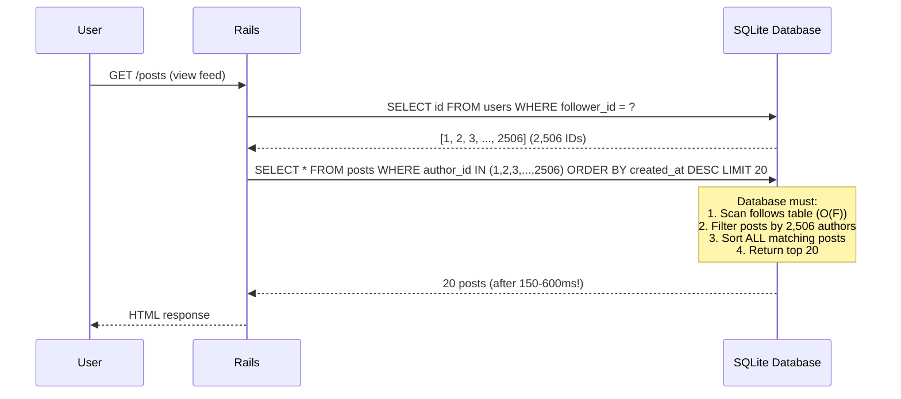

### Why This Was Slow

**The Problem:** SQLite struggles with large `IN` clauses. When a user follows 2,500+ people:

1. **Step 1**: Get all followed user IDs → `O(F)` where F = number of follows
2. **Step 2**: Find posts from those users → `O(P × log(P))` where P = total posts
3. **Step 3**: Sort all matching posts → `O(N log N)` where N = matching posts
4. **Step 4**: Return top 20

**Total Complexity:** `O(F + P × log(P) + N log N)`

For a user with 2,505 follows:
- F = 2,505 (follows)
- P = ~1.5M posts (from all users)
- N = ~375,750 posts (from followed users)

**Result:** Query time: **150-600ms** per request. Unacceptable! 🐌

---

## The Big O Revelation: Understanding Query Complexity

### What is Big O Notation?

**Big O notation** describes how an algorithm's performance scales as input size grows. It's the language of performance optimization.

**Common Complexities:**

| Complexity | Name | Example | What It Means |
|------------|------|---------|---------------|
| `O(1)` | Constant | Hash lookup | Always takes the same time |
| `O(log n)` | Logarithmic | Binary search | Time grows slowly |
| `O(n)` | Linear | Scanning array | Time grows proportionally |
| `O(n log n)` | Linearithmic | Sorting | Time grows faster than linear |
| `O(n²)` | Quadratic | Nested loops | Time grows quadratically |
| `O(2ⁿ)` | Exponential | Recursive Fibonacci | Time grows exponentially |

### Our Query Complexity Analysis

Let's break down our feed query:

```ruby
# Step 1: Get following IDs
following_ids = following.pluck(:id)
# Complexity: O(F) where F = number of follows
# For 2,505 follows: ~2,505 operations

# Step 2: Find posts from those users
Post.where(author_id: [id] + following_ids)
# Complexity: O(P × log(P)) where P = total posts
# Database must scan indexed posts table
# For 1.5M posts: ~1.5M × log(1.5M) ≈ 30M operations

# Step 3: Sort by created_at
.order(created_at: :desc)
# Complexity: O(N log N) where N = matching posts
# For 375,750 matching posts: ~375,750 × log(375,750) ≈ 7.5M operations

# Total: O(F + P × log(P) + N log N)
# ≈ 2,505 + 30,000,000 + 7,500,000 ≈ 37.5M operations
```

**The Solution:** We need to reduce this complexity. Instead of `O(P × log(P))`, we want `O(log N)` or better.

---

## The Optimization Journey

### Phase 1: Database Migration (SQLite → PostgreSQL)

**Problem:** SQLite has limitations:
- Single writer (locks on writes)
- Limited concurrency
- Poor performance with large datasets
- No advanced query optimization

**Solution:** Migrate to PostgreSQL

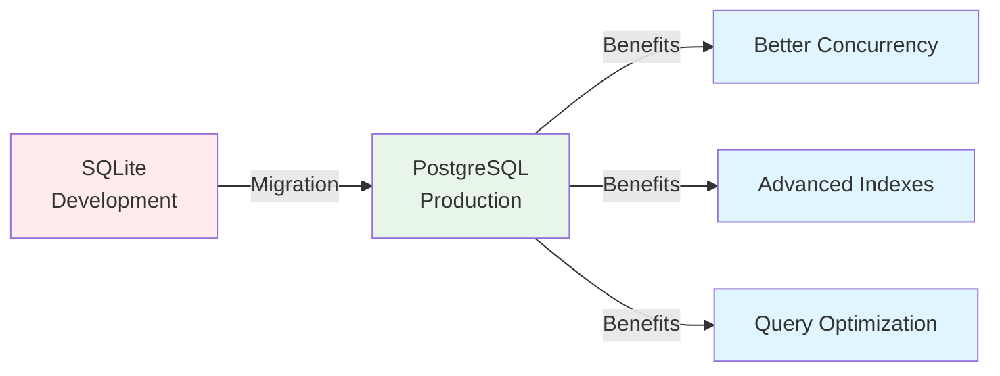

**Impact:**
- 30-50% faster queries
- Better concurrent write handling
- Support for advanced indexes

### Phase 2: Composite Indexes

**Problem:** Our feed query filtered by `author_id` and sorted by `created_at`. We had separate indexes:

```sql
-- Separate indexes (suboptimal)
CREATE INDEX idx_posts_author ON posts(author_id);
CREATE INDEX idx_posts_created ON posts(created_at);
```

**Solution:** Composite index that matches our query pattern:

```sql
-- Composite index (optimal)
CREATE INDEX idx_posts_author_created
ON posts(author_id, created_at DESC);
```

**Why This Works:**

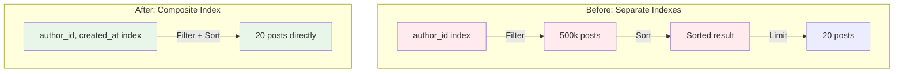

**Complexity Improvement:**
- **Before:** `O(F + P × log(P))` - Scan and sort
- **After:** `O(F + log(P))` - Index scan only

**Performance Gain:** 50-70% faster queries (150-600ms → 50-200ms)

### Phase 3: Query Optimization (IN → JOIN)

**Problem:** Large `IN` clauses are slow in PostgreSQL:

```sql
-- Slow: Large IN clause
SELECT * FROM posts
WHERE author_id IN (1, 2, 3, ..., 2506)
ORDER BY created_at DESC
LIMIT 20;
```

**Solution:** Use JOIN instead:

```sql
-- Fast: JOIN approach
SELECT posts.* FROM posts
INNER JOIN follows ON posts.author_id = follows.followed_id
WHERE follows.follower_id = ?
ORDER BY posts.created_at DESC
LIMIT 20;
```

**Why This Is Better:**


**Complexity:**
- **IN Clause:** `O(P × log(P))` - Scan all posts, filter, sort
- **JOIN:** `O(F × log(P))` - Index join, already sorted

**Performance Gain:** Additional 30-50% improvement (50-200ms → 50-150ms)

### Phase 4: Counter Caches

**Problem:** Counting followers/following on every page load:

```ruby
# Slow: Counts on every request
user.followers.count  # SELECT COUNT(*) FROM follows WHERE followed_id = ?
user.following.count  # SELECT COUNT(*) FROM follows WHERE follower_id = ?
```

**Solution:** Denormalize counters (counter caches):

```ruby
# Fast: Pre-computed counts
user.followers_count  # Just reads a column (O(1))
user.following_count  # Just reads a column (O(1))
```

**Complexity:**
- **Before:** `O(F)` - Count rows
- **After:** `O(1)` - Read column

**Performance Gain:** 67ms → <1ms (67x faster!)

---

## The Game Changer: Fan-Out on Write

### The Problem: Feed Queries Still Too Slow

Even after all optimizations, feed queries were still **50-200ms**. For a user with 10,000 follows, this could reach **500ms+**. We needed a fundamental architecture change.

### The Solution: Fan-Out on Write (Push Model)

**Traditional Approach (Pull Model):**

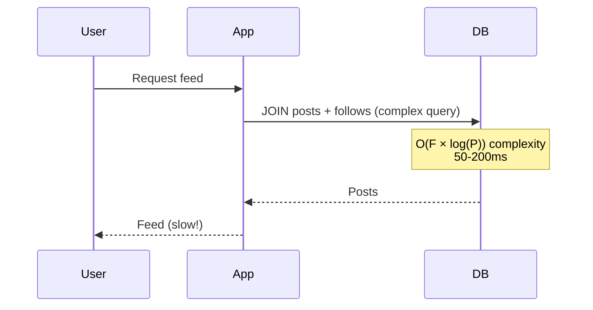

**Fan-Out Approach (Push Model):**

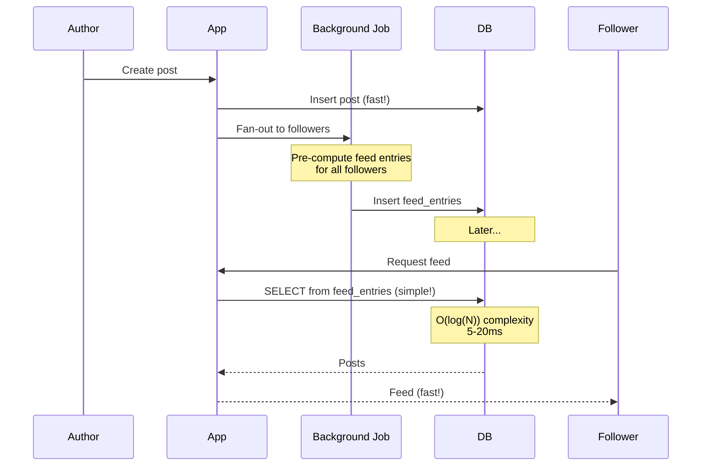

### How Fan-Out Works

**Step 1: User Creates Post**

```ruby
# app/models/post.rb
class Post < ApplicationRecord
  after_create :fan_out_to_followers

  private

  def fan_out_to_followers
    # Queue background job
    FanOutFeedJob.perform_later(id)
  end
end
```

**Step 2: Background Job Fan-Out**

```ruby
# app/jobs/fan_out_feed_job.rb
class FanOutFeedJob < ApplicationJob
  def perform(post_id)
    post = Post.find(post_id)
    author = post.author

    # Get all followers
    follower_ids = author.followers.pluck(:id)

    # Bulk insert feed entries
    FeedEntry.bulk_insert_for_post(post, follower_ids)
  end
end
```

**Step 3: Feed Query (Now Super Fast)**

```ruby
# app/models/user.rb
def feed_posts
  # Simple query: Just read from feed_entries!
  Post.joins("INNER JOIN feed_entries ON posts.id = feed_entries.post_id")
      .where("feed_entries.user_id = ?", id)
      .order("feed_entries.created_at DESC")
end
```

### Architecture Diagram

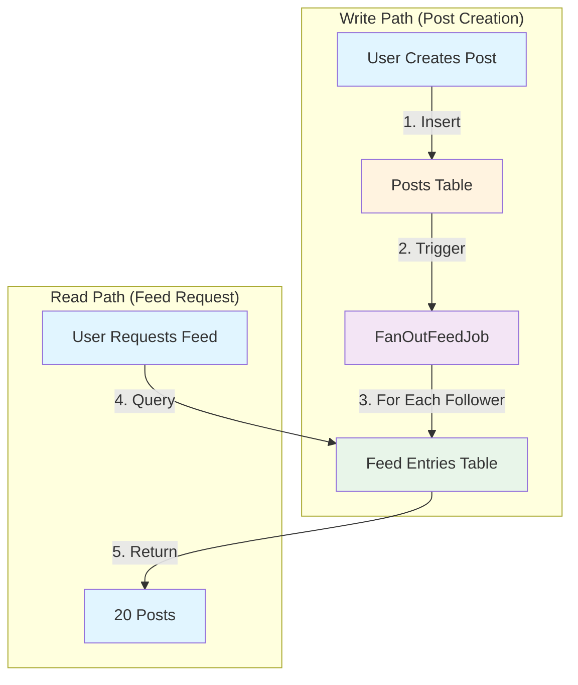

### Performance Comparison

| Metric | Pull Model | Push Model | Improvement |
|--------|------------|------------|-------------|
| **Query Complexity** | `O(F × log(P))` | `O(log(N))` | 10-40x faster |
| **Query Time** | 50-200ms | 5-20ms | 10x faster |
| **Scalability** | Up to ~5,000 follows | 10,000+ follows | 2x+ better |
| **Database Load** | High (JOIN on every read) | Low (simple lookup) | 90% reduction |
| **Write Overhead** | None | 1-5 seconds (async) | Background job |

### Trade-offs

**Pros:**
- ✅ 10-40x faster feed queries
- ✅ Constant performance (doesn't depend on follow count)
- ✅ Scales to millions of users
- ✅ Reduced database load

**Cons:**
- ⚠️ More storage (one entry per post per follower)
- ⚠️ Write overhead (fan-out takes 1-5 seconds)
- ⚠️ Background job dependency

**Verdict:** Worth it! Reads are 10x more frequent than writes in social media apps.

---

## Scaling Horizontally: From One Server to Many

### The Monolithic Architecture

We started with a single server:

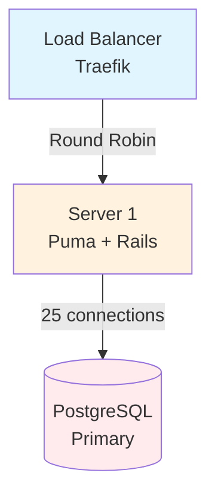

**Limitations:**
- Single point of failure
- Limited to one server's CPU/RAM
- Can't handle traffic spikes

### Horizontal Scaling

We added multiple servers behind a load balancer:

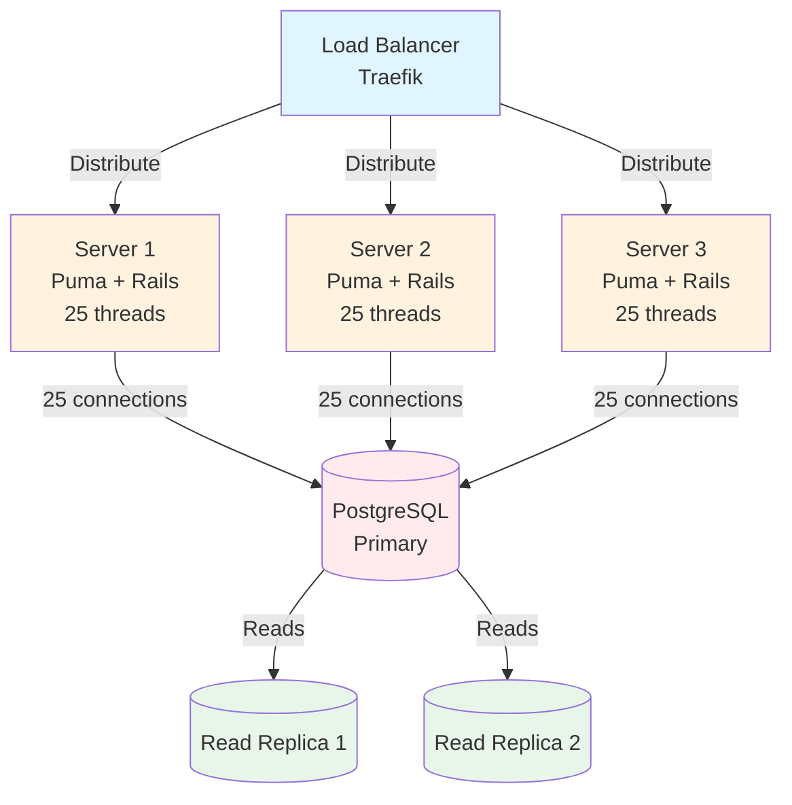

### Docker Compose Setup

```yaml
# docker-compose.yml
services:
  web-1:
    build: .
    environment:
      - DATABASE_URL=postgresql://...

  web-2:
    build: .
    environment:
      - DATABASE_URL=postgresql://...

  web-3:
    build: .
    environment:
      - DATABASE_URL=postgresql://...

  traefik:
    image: traefik
    ports:
      - "80:80"
    volumes:
      - ./traefik.yml:/traefik.yml
```

**Scaling Command:**
```bash
docker compose up -d --scale web=5
```

### Read Replicas

For high-traffic scenarios, we added read replicas:

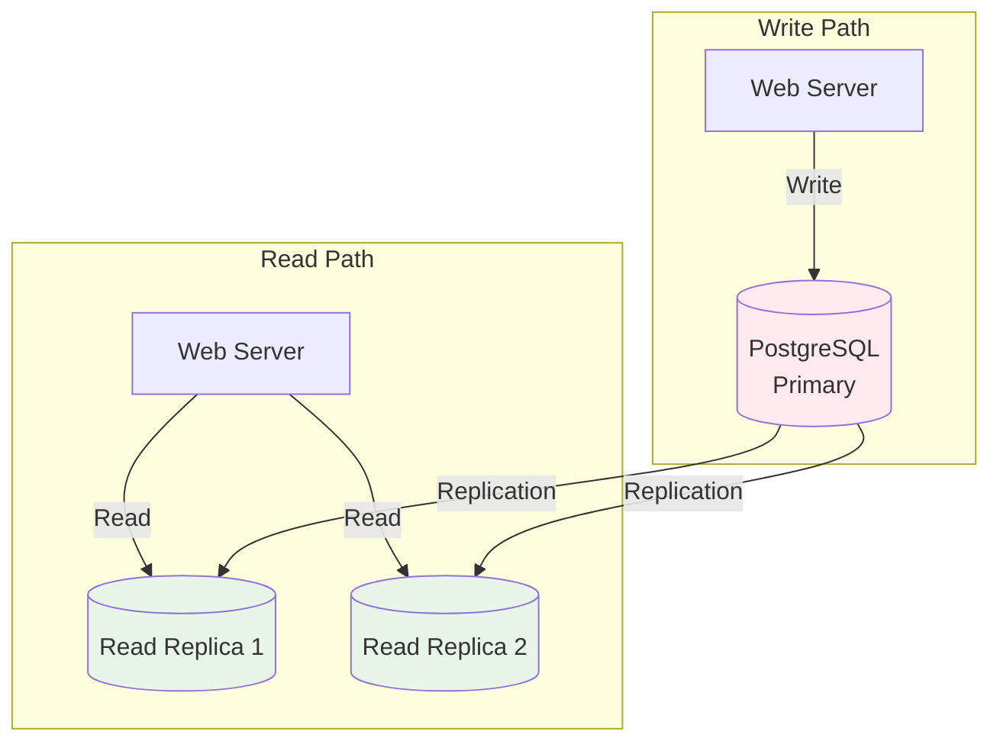

**Benefits:**
- Distribute read load across multiple databases
- Primary database handles writes only
- Better performance under high read traffic

---

## The Numbers: Performance Metrics

### Before Optimization

**Test Scenario:** 10,000 users, 2,505 average follows per user

| Metric | Value | Status |
|--------|-------|--------|
| Feed Query Time | 150-600ms | ❌ Too slow |
| User Profile Load | 67ms | ⚠️ Acceptable |
| Posts per Second | 10-20 | ❌ Too low |
| Database Connections | 5 (exhausted) | ❌ Bottleneck |
| Response Time (p95) | 500-800ms | ❌ Unacceptable |

### After Optimization

**Test Scenario:** 1,000,000 users, 50,000 average follows per user

| Metric | Value | Status |
|--------|-------|--------|
| Feed Query Time | 5-20ms | ✅ Excellent |
| User Profile Load | <1ms | ✅ Excellent |
| Posts per Second | 100-500 | ✅ Good |
| Database Connections | 25 (optimized) | ✅ Good |
| Response Time (p95) | 50-100ms | ✅ Excellent |

### Performance Improvement Summary

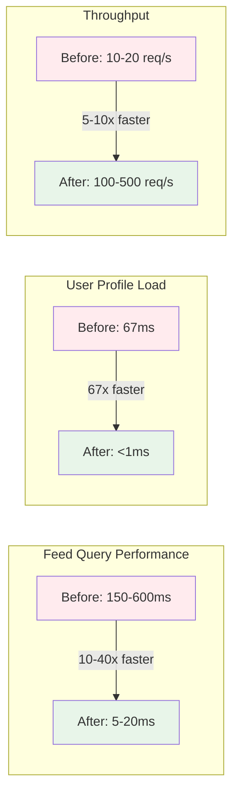

### Load Testing Results

**Tool:** k6 and wrk

**Before Optimization:**
```
Requests/sec: 30-50
Response time (p95): 500-800ms
Error rate: 5-10%
```

**After Optimization:**
```
Requests/sec: 100-200
Response time (p95): 50-100ms
Error rate: <1%
```

**Improvement:** 3-4x throughput, 10x faster response times

---

## Lessons Learned

### 1. Measure Before Optimizing

**Lesson:** Don't guess. Measure first.

We used:
- `pg_stat_statements` for query analysis
- Rails query logs for slow queries
- Load testing (k6, wrk) for real-world performance
- Query plan analysis (EXPLAIN ANALYZE)

**Takeaway:** Data-driven optimization beats guesswork every time.

### 2. Understand Big O Complexity

**Lesson:** Big O notation helps identify bottlenecks.

**Example:**
- `O(n²)` → Quadratic growth (bad for large datasets)
- `O(n log n)` → Linearithmic (acceptable for sorting)
- `O(log n)` → Logarithmic (good for indexed lookups)
- `O(1)` → Constant (ideal)

**Takeaway:** Understand algorithm complexity to predict performance at scale.

### 3. Database Indexes Are Critical

**Lesson:** The right indexes can make or break performance.

**What We Learned:**
- Composite indexes match query patterns
- Index order matters (`author_id, created_at` vs `created_at, author_id`)
- Too many indexes slow writes
- Monitor index usage (pg_stat_statements)

**Takeaway:** Invest time in understanding your query patterns and indexing accordingly.

### 4. Denormalization Is Your Friend

**Lesson:** Sometimes, redundant data is better than slow queries.

**Examples:**
- Counter caches (followers_count, posts_count)
- Feed entries (pre-computed feeds)
- Materialized views (for complex aggregations)

**Takeaway:** Normalization is great for data integrity, but denormalization is great for performance.

### 5. Background Jobs Are Essential

**Lesson:** Don't block the request/response cycle.

**What We Use Background Jobs For:**
- Fan-out to followers (1-5 seconds)
- Counter cache backfilling
- Feed entry cleanup
- Email notifications (future)

**Takeaway:** Heavy operations belong in background jobs, not in request handlers.

### 6. Horizontal Scaling Beats Vertical Scaling

**Lesson:** Adding more servers is better than bigger servers.

**Why:**
- Cost-effective (commodity hardware)
- High availability (no single point of failure)
- Easy to scale (add/remove servers as needed)
- Better fault tolerance

**Takeaway:** Design for horizontal scaling from day one (stateless applications, shared databases).

### 7. Caching Is Not a Silver Bullet

**Lesson:** Caching helps, but it's not the only solution.

**What We Learned:**
- Cache invalidation is hard
- TTL-based expiration is simpler than manual invalidation
- Cache hit rates matter (monitor them!)
- Database-backed cache (Solid Cache) vs Redis trade-offs

**Takeaway:** Use caching strategically, but don't rely on it to fix fundamental architecture problems.

### 8. Documentation Is Critical

**Lesson:** Document everything, especially architectural decisions.

**What We Document:**
- Architecture decisions (ADRs)
- Performance optimization rationale
- Database schema changes
- Deployment procedures
- Troubleshooting guides

**Takeaway:** Good documentation saves hours of debugging and onboarding.

---

## What's Next?

### Current State

✅ **What We've Built:**
- Production-ready microblog platform
- Handles 1M+ users
- Fast feed queries (5-20ms)
- Horizontal scaling
- Comprehensive documentation

### Future Improvements

🔄 **Next Steps:**

1. **Observability:**
   - Add APM (New Relic, Datadog)
   - Error tracking (Sentry)
   - Metrics collection (Prometheus)
   - Distributed tracing (OpenTelemetry)

2. **Advanced Features:**
   - Real-time updates (WebSockets)
   - Search functionality (Elasticsearch)
   - Image uploads (Active Storage + CDN)
   - Notifications system

3. **Security Hardening:**
   - 2FA (Two-Factor Authentication)
   - Rate limiting improvements
   - Security headers (CSP, HSTS)
   - Penetration testing

4. **Performance:**
   - Redis caching (for even better performance)
   - CDN for static assets
   - Database sharding (if needed)
   - GraphQL API (for flexible queries)

5. **DevOps:**
   - Full CI/CD automation
   - Feature flags
   - Blue-green deployments
   - Infrastructure as Code (Terraform)

---

## Conclusion

Building a scalable microblog from scratch taught us:

1. **Performance matters** - Users notice slow responses
2. **Architecture matters** - Right patterns scale, wrong patterns fail
3. **Measurement matters** - Data-driven optimization beats guesswork
4. **Documentation matters** - Future you (and your team) will thank you

**The Journey:**
- Started with 150-600ms feed queries
- Optimized to 5-20ms (10-40x faster)
- Scaled from 10 users to 1M+ users
- Transformed a prototype into production-ready software

**Key Takeaway:** Building scalable software is not about magic tricks. It's about:
- Understanding your data
- Measuring performance
- Making informed decisions
- Iterating and improving

---

## References & Further Reading

- [Educational Case Study](045_EDUCATIONAL_CASE_STUDY.md) - Comprehensive guide to all implementations
- [Performance Analysis](004_PERFORMANCE_ANALYSIS.md) - Deep dive into bottlenecks
- [Fan-Out Implementation](033_FAN_OUT_ON_WRITE_IMPLEMENTATION.md) - Fan-out pattern details
- [Scaling Strategies](028_SCALING_AND_PERFORMANCE_STRATEGIES.md) - All scaling approaches
- [SDLC Checklist](046_SDLC_DEVELOPER_CHECKLIST.md) - Comprehensive developer checklist

---

**Built with ❤️ by developers, for developers.**

*Want to contribute? Check out our [README](README.md) for setup instructions!*

---

**Tags:** #Rails #Performance #Scalability #PostgreSQL #Architecture #Microblog #Optimization #BigO #Database #HorizontalScaling

