# API Optimization Strategies

> **Comprehensive guide to optimizing API performance through pagination, caching, connection pooling, compression, and asynchronous operations**

This document covers six critical API optimization strategies with detailed explanations, implementation examples, and performance comparisons. Each strategy is illustrated with Mermaid diagrams for clarity.

---

## Table of Contents

1. [Pagination](#1-pagination)
2. [Asynchronous Logging](#2-asynchronous-logging)
3. [Payload Compression](#3-payload-compression)
4. [Caching Strategies](#4-caching-strategies)
5. [Connection Pooling](#5-connection-pooling)
6. [PgBouncer](#6-pgbouncer)

---

## 1. Pagination

### Overview

Pagination is essential for APIs that return large datasets. Without pagination, a single request could return thousands or millions of records, causing:
- Slow response times
- High memory usage
- Network bandwidth waste
- Poor user experience

### Current Implementation: Cursor-Based Pagination

**How It Works:**

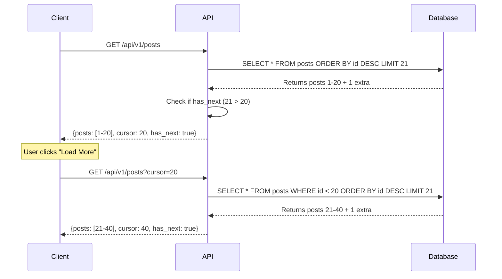

**Implementation:**

```ruby
# app/controllers/application_controller.rb
def cursor_paginate(relation, per_page: 20, cursor: nil, order: :desc)
  cursor_id = cursor || params[:cursor]&.to_i

  if cursor_id.present? && cursor_id > 0
    if order == :asc
      relation = relation.where("posts.id > ?", cursor_id)
    else
      relation = relation.where("posts.id < ?", cursor_id)
    end
  end

  # Get one extra to check for next page
  items = relation.limit(per_page + 1).to_a
  has_next = items.length > per_page
  items = items.take(per_page) if has_next

  next_cursor = items.last&.id

  [items, next_cursor, has_next]
end
```

**API Response Format:**

```json
{
  "posts": [
    {"id": 1, "content": "..."},
    {"id": 2, "content": "..."}
  ],
  "pagination": {
    "cursor": 20,
    "has_next": true
  }
}
```

**Performance Characteristics:**

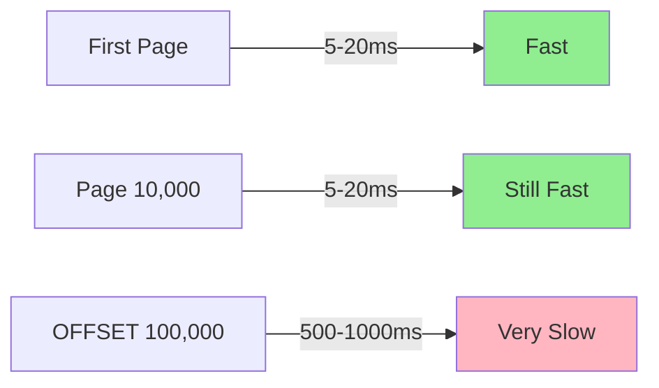

**Why Cursor-Based is Fast:**

1. **Index Usage**: `WHERE id < cursor` uses the primary key index directly
2. **No Row Skipping**: Database doesn't need to count/skip rows
3. **Constant Performance**: Query time doesn't increase with page number

**SQL Comparison:**

```sql
-- Cursor-based (FAST - uses index)
SELECT * FROM posts WHERE id < 12345 ORDER BY id DESC LIMIT 20;
-- Execution: ~5-20ms (uses index scan)

-- OFFSET-based (SLOW - scans rows)
SELECT * FROM posts ORDER BY id DESC LIMIT 20 OFFSET 100000;
-- Execution: ~500-1000ms (must skip 100k rows)
```

### Alternative Pagination Strategies

#### 1. Offset-Based Pagination

**How It Works:**

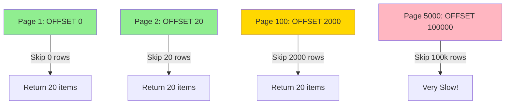

**Pros:**
- ✅ Simple to implement
- ✅ Supports "jump to page N"
- ✅ Works with any ordering

**Cons:**
- ❌ Performance degrades with page number
- ❌ Inconsistent results if data changes during pagination
- ❌ Can't handle very large offsets efficiently

**When to Use:**
- Small datasets (< 10,000 records)
- When users need to jump to specific pages
- When data doesn't change frequently

#### 2. Keyset Pagination (Cursor-Based)

**What We Use:** This is our current implementation.

**Pros:**
- ✅ Constant performance regardless of page number
- ✅ Consistent results (no duplicates/skips)
- ✅ Works well with indexes

**Cons:**
- ❌ No "jump to page N" support
- ❌ Requires sequential IDs or timestamps
- ❌ Forward-only navigation

**When to Use:**
- Large datasets (millions of records)
- Feed-style interfaces (infinite scroll)
- When performance is critical

#### 3. Seek Pagination

**How It Works:**

```ruby
# Use composite cursor (created_at, id)
def seek_paginate(relation, per_page: 20, cursor: nil)
  if cursor
    created_at, id = cursor.split(':')
    relation = relation.where(
      "(created_at, id) < (?, ?)",
      created_at, id
    )
  end

  relation.order(created_at: :desc, id: :desc)
          .limit(per_page + 1)
end
```

**Pros:**
- ✅ Works with non-sequential IDs
- ✅ Handles ties correctly
- ✅ More flexible than simple cursor

**Cons:**
- ❌ More complex implementation
- ❌ Requires composite index
- ❌ Slightly slower than ID-based cursor

**When to Use:**
- When IDs are not sequential (UUIDs, etc.)
- When ordering by timestamp with potential ties
- When you need perfect ordering

#### 4. Page-Based with Total Count

**How It Works:**

```ruby
def page_based_paginate(relation, page: 1, per_page: 20)
  total = relation.count
  items = relation.offset((page - 1) * per_page).limit(per_page)

  {
    items: items,
    pagination: {
      page: page,
      per_page: per_page,
      total: total,
      total_pages: (total / per_page.to_f).ceil
    }
  }
end
```

**Pros:**
- ✅ Shows total count
- ✅ Supports "jump to page"
- ✅ Familiar to users

**Cons:**
- ❌ `COUNT(*)` is expensive on large tables
- ❌ Performance degrades with page number
- ❌ Inconsistent if data changes

**When to Use:**
- Small to medium datasets
- When total count is required
- Traditional web interfaces

### Performance Comparison

| Strategy | Page 1 | Page 100 | Page 10,000 | Page 100,000 |
|----------|--------|----------|-------------|--------------|
| **Cursor-Based** | 5ms | 5ms | 5ms | 5ms |
| **Offset-Based** | 5ms | 20ms | 200ms | 2000ms |
| **Seek Pagination** | 8ms | 8ms | 8ms | 8ms |
| **Page-Based** | 50ms* | 70ms* | 500ms* | 5000ms* |

*Includes COUNT(*) query overhead

### Recommendations

**For Our Microblog:**

✅ **Current Choice: Cursor-Based** is optimal because:
- Feed queries are the most common operation
- Users typically scroll forward (infinite scroll)
- Performance is critical (millions of posts)
- No need for "jump to page" functionality

**Future Enhancements:**
- Add seek pagination for replies (ordered by `created_at`)
- Implement composite cursor `(created_at, id)` for perfect ordering
- Add prefetching for next page in background

---

## 2. Asynchronous Logging

### Overview

Synchronous logging blocks the request/response cycle, adding latency to every API call. Asynchronous logging moves log writes to background threads, improving response times.

### The Problem with Synchronous Logging

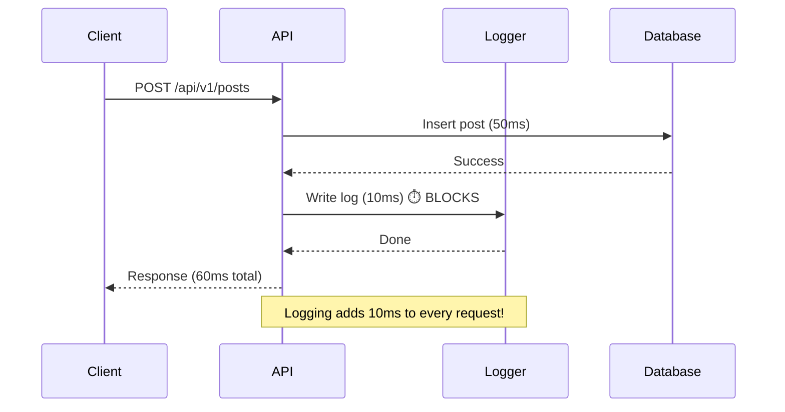

**Impact:**
- Every request waits for log write
- File I/O is slow (10-50ms per write)
- Under high load, logging becomes a bottleneck
- Can cause request timeouts

### Asynchronous Logging Solution

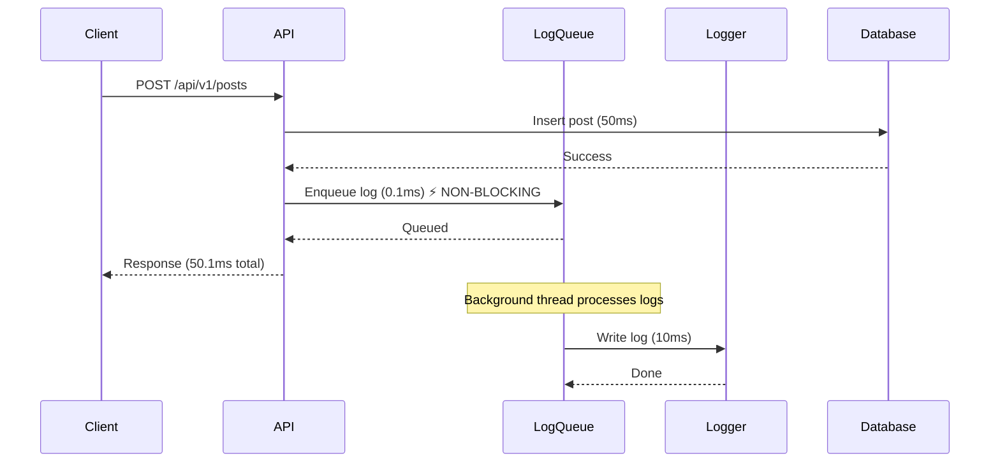

**Benefits:**
- ✅ Non-blocking: Request returns immediately
- ✅ Better performance: 10-50ms saved per request
- ✅ Handles bursts: Queue absorbs traffic spikes
- ✅ Fault tolerant: Log failures don't affect requests

### Implementation Strategies

#### Strategy 1: Background Thread Pool

**Rails Implementation:**

```ruby
# config/initializers/async_logger.rb
require 'concurrent'

class AsyncLogger
  def initialize(logger)
    @logger = logger
    @queue = Concurrent::Array.new
    @thread_pool = Concurrent::ThreadPoolExecutor.new(
      min_threads: 2,
      max_threads: 5,
      max_queue: 1000
    )
  end

  def info(message)
    @thread_pool.post do
      @logger.info(message)
    end
  rescue => e
    # Fallback to synchronous if queue is full
    @logger.error("Async logging failed: #{e.message}")
    @logger.info(message)
  end

  def error(message)
    # Errors are always synchronous (critical)
    @logger.error(message)
  end
end

# Replace default logger
Rails.logger = AsyncLogger.new(ActiveSupport::Logger.new(STDOUT))
```

**Pros:**
- ✅ Simple implementation
- ✅ No external dependencies
- ✅ Works with any logger

**Cons:**
- ❌ In-memory queue (lost on crash)
- ❌ Limited queue size
- ❌ Thread management overhead

#### Strategy 2: Background Job Queue

**Using Solid Queue:**

```ruby
# app/jobs/log_job.rb
class LogJob < ApplicationJob
  queue_as :logs

  def perform(level, message, metadata = {})
    Rails.logger.send(level, message)
    # Also send to external service (Datadog, CloudWatch, etc.)
    ExternalLogService.send(level, message, metadata)
  end
end

# Usage in controllers
class Api::V1::PostsController < BaseController
  after_action :log_request_async

  private

  def log_request_async
    LogJob.perform_later(
      :info,
      "API Request: #{request.method} #{request.path}",
      {
        user_id: current_user&.id,
        response_time: @response_time,
        status: response.status
      }
    )
  end
end
```

**Pros:**
- ✅ Persistent queue (survives crashes)
- ✅ Retry on failure
- ✅ Can batch logs
- ✅ Integrates with existing job infrastructure

**Cons:**
- ❌ Slight overhead (job enqueue)
- ❌ Requires job processor running
- ❌ More complex setup

#### Strategy 3: External Logging Service

**Using Fluentd / Logstash:**

```ruby
# config/initializers/fluent_logger.rb
require 'fluent-logger'

class FluentLogger
  def initialize
    @logger = Fluent::Logger::FluentLogger.new(
      'microblog',
      host: ENV['FLUENTD_HOST'] || 'localhost',
      port: ENV['FLUENTD_PORT'] || 24224
    )
  end

  def info(message, metadata = {})
    @logger.post('api.request', {
      message: message,
      timestamp: Time.current.iso8601,
      **metadata
    })
  end
end

# Async by default (Fluentd handles buffering)
Rails.application.config.logger = FluentLogger.new
```

**Architecture:**

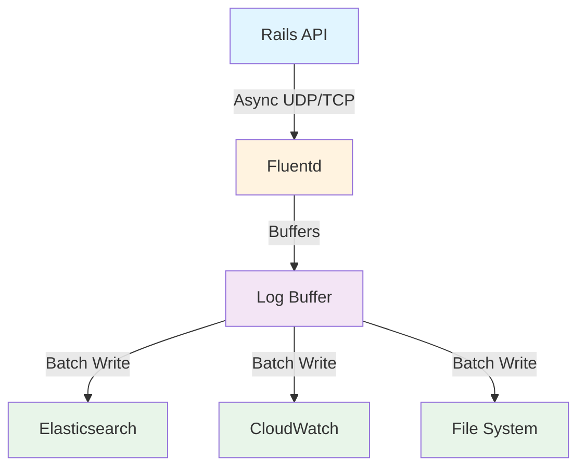

**Pros:**
- ✅ Highly scalable
- ✅ Centralized logging
- ✅ Multiple outputs
- ✅ Built-in buffering

**Cons:**
- ❌ Requires external service
- ❌ Network overhead
- ❌ More complex setup

### Performance Impact

**Synchronous Logging:**
```
Request time: 50ms (DB) + 10ms (Log) = 60ms
Throughput: ~16 requests/second per thread
```

**Asynchronous Logging:**
```
Request time: 50ms (DB) + 0.1ms (Enqueue) = 50.1ms
Throughput: ~20 requests/second per thread
Improvement: 20% faster responses
```

### Recommendations

**For Our Microblog:**

✅ **Recommended: Background Job Queue (Solid Queue)**

**Why:**
- Already using Solid Queue for other jobs
- Persistent queue (logs not lost)
- Can batch multiple log entries
- Easy to add external log services later

**Implementation Priority:**
1. **High**: Request/response logging (most frequent)
2. **Medium**: Error logging (critical but less frequent)
3. **Low**: Debug logging (development only)

**Configuration:**

```ruby
# config/environments/production.rb
config.log_level = :info  # Reduce log volume

# Use async logging for non-critical logs
config.after_initialize do
  if defined?(SolidQueue)
    # Route logs through Solid Queue
    Rails.logger.extend(AsyncLogging)
  end
end
```

---

## 3. Payload Compression

### Overview

API responses can be large, especially for endpoints that return many records. Compression reduces bandwidth usage, improves transfer speeds, and enhances user experience, particularly on mobile networks.

### The Problem

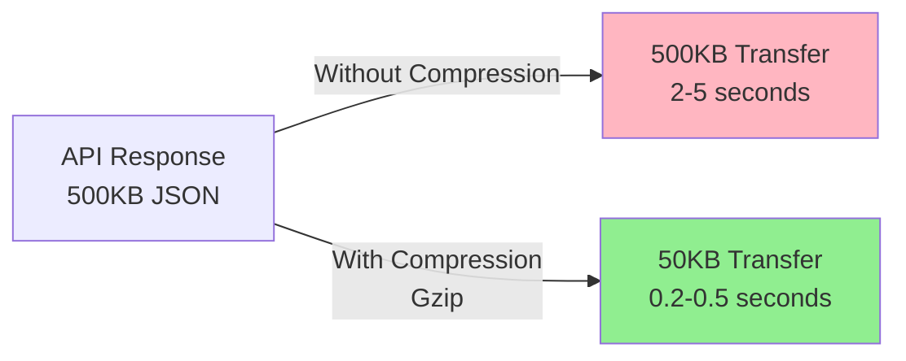

**Impact:**
- Slow response times on slow networks
- High bandwidth costs
- Poor mobile user experience
- Increased server load

### Compression Strategies

#### Strategy 1: HTTP Compression (Gzip/Brotli)

**How It Works:**

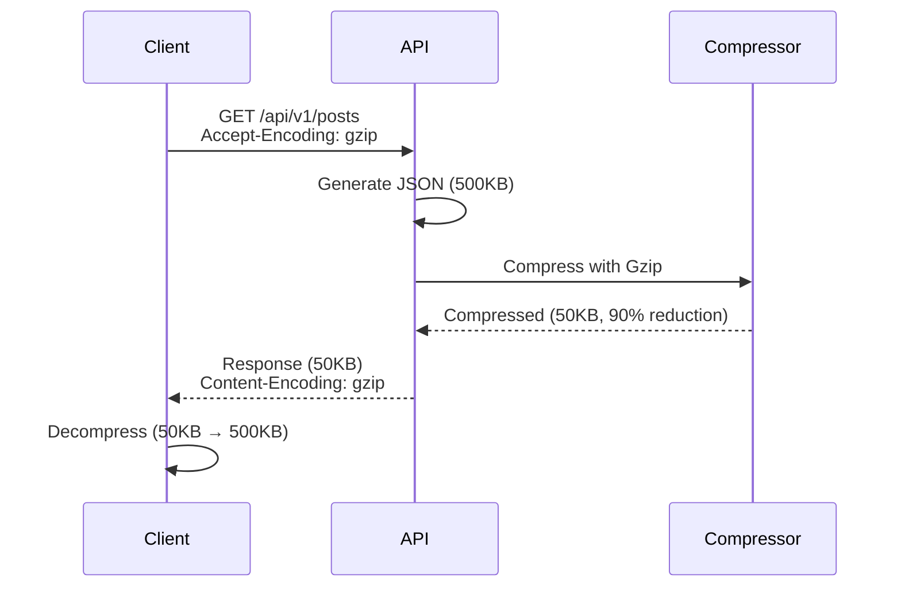

**Rails Implementation:**

```ruby
# config/application.rb
# Rails automatically enables gzip compression via Rack::Deflater
# No additional configuration needed!

# For API-only mode, ensure middleware is enabled:
config.middleware.use Rack::Deflater

# Or configure manually:
config.middleware.insert_before Rack::Sendfile, Rack::Deflater, {
  if: ->(env, status, headers, body) {
    # Only compress API responses
    env['PATH_INFO'].start_with?('/api/') &&
    status == 200 &&
    headers['Content-Type']&.include?('application/json')
  }
}
```

**Compression Levels:**

| Level | Compression Ratio | CPU Usage | Use Case |
|-------|------------------|-----------|----------|
| **1 (Fastest)** | 60-70% | Low | High traffic, low latency |
| **6 (Default)** | 80-90% | Medium | Balanced |
| **9 (Best)** | 85-95% | High | Low traffic, maximum savings |

**Brotli Compression (Better than Gzip):**

```ruby
# Add to Gemfile
gem 'brotli'

# config/initializers/compression.rb
require 'brotli'

class BrotliCompressor
  def compress(data)
    Brotli.deflate(data, quality: 6)
  end
end

# Use in middleware
config.middleware.use Rack::Deflater, {
  include: %w[application/json text/html],
  if: ->(env) { env['HTTP_ACCEPT_ENCODING']&.include?('br') }
}
```

**Performance Comparison:**

| Compression | Original Size | Compressed | Ratio | CPU Overhead |
|-------------|---------------|------------|-------|--------------|
| **None** | 500KB | 500KB | 0% | 0% |
| **Gzip (Level 6)** | 500KB | 50KB | 90% | 5-10% |
| **Brotli (Level 6)** | 500KB | 40KB | 92% | 8-15% |

#### Strategy 2: JSON Compression (MessagePack)

**How It Works:**

Instead of JSON, use binary format (MessagePack):

```ruby
# Add to Gemfile
gem 'msgpack'

# Serialize to MessagePack
class Api::V1::PostsController < BaseController
  def index
    posts = Post.limit(20)

    # Option 1: Use MessagePack instead of JSON
    render msgpack: posts.map { |p| post_hash(p) }

    # Option 2: Compress JSON response
    json_data = posts.map { |p| post_hash(p) }.to_json
    compressed = Zlib::Deflate.deflate(json_data)
    render body: compressed, content_type: 'application/json+deflate'
  end
end
```

**Comparison:**

| Format | Size | Parse Time | Compatibility |
|--------|------|------------|---------------|
| **JSON** | 500KB | 10ms | Universal |
| **JSON + Gzip** | 50KB | 15ms | Universal |
| **MessagePack** | 300KB | 5ms | Requires client support |
| **MessagePack + Gzip** | 30KB | 10ms | Requires client support |

**Pros:**
- ✅ Smaller than JSON
- ✅ Faster parsing
- ✅ Native binary format

**Cons:**
- ❌ Requires client support
- ❌ Less human-readable
- ❌ Not standard for REST APIs

#### Strategy 3: Field Selection / Sparse Fieldsets

**Reduce Payload by Requesting Only Needed Fields:**

```ruby
# Client request
GET /api/v1/posts?fields=id,content,created_at

# Response (only requested fields)
{
  "posts": [
    {"id": 1, "content": "...", "created_at": "2024-01-01"},
    // No author, no replies_count, etc.
  ]
}
```

**Implementation:**

```ruby
class Api::V1::PostsController < BaseController
  def index
    posts = Post.limit(20)

    # Only include requested fields
    fields = params[:fields]&.split(',') || default_fields

    render json: {
      posts: posts.map { |p| post_hash(p, fields: fields) }
    }
  end

  private

  def post_hash(post, fields: nil)
    hash = {}
    (fields || default_fields).each do |field|
      hash[field] = post.send(field)
    end
    hash
  end

  def default_fields
    %w[id content author_id created_at]
  end
end
```

**Size Reduction:**

| Fields | Size | Reduction |
|--------|------|-----------|
| **All fields** | 500KB | 0% |
| **Essential only** | 200KB | 60% |
| **Minimal** | 100KB | 80% |

#### Strategy 4: Pagination + Compression

**Combine Strategies:**

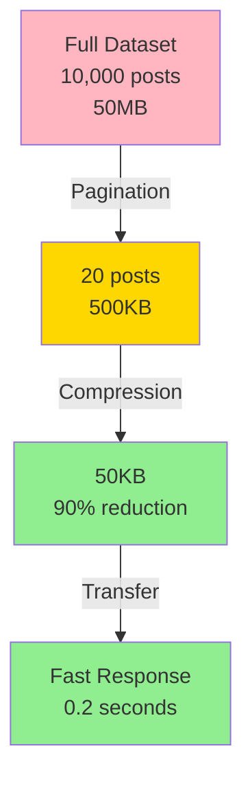

### Recommendations

**For Our Microblog:**

✅ **Recommended: HTTP Gzip Compression (Rack::Deflater)**

**Why:**
- ✅ Already available in Rails (no setup needed)
- ✅ Automatic (browser handles decompression)
- ✅ 80-90% size reduction
- ✅ Minimal CPU overhead
- ✅ Works with all clients

**Configuration:**

```ruby
# config/environments/production.rb
# Already enabled by default, but can optimize:

config.middleware.use Rack::Deflater, {
  # Only compress responses > 1KB
  if: ->(env, status, headers, body) {
    status == 200 &&
    headers['Content-Length']&.to_i > 1024
  }
}
```

**Additional Optimizations:**
1. **Enable Brotli** for modern browsers (better compression)
2. **Use field selection** for mobile clients (reduce payload)
3. **Cache compressed responses** (avoid re-compression)

**Expected Impact:**
- Response size: 500KB → 50KB (90% reduction)
- Transfer time: 2-5s → 0.2-0.5s (10x faster)
- Bandwidth savings: 90% reduction
- Mobile experience: Significantly improved

---

## 4. Caching Strategies

### Overview

Caching stores frequently accessed data in fast storage to avoid expensive database queries. This is one of the most effective ways to improve API performance.

### Current Implementation: Solid Cache

**What is Solid Cache?**

Solid Cache is Rails 8's built-in database-backed caching solution. It stores cached data in PostgreSQL (or SQLite) rather than requiring a separate Redis/Memcached server.

**Architecture:**

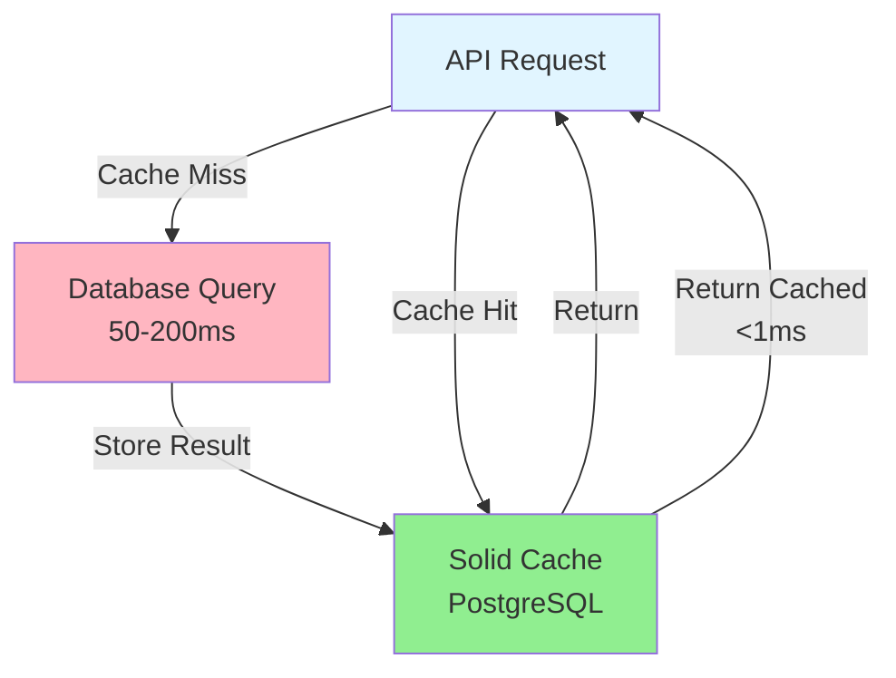

**Current Usage:**

```ruby
# app/controllers/posts_controller.rb
def index
  cache_key = "user_feed:#{current_user.id}:#{params[:cursor]}"
  cached_result = Rails.cache.read(cache_key)

  if cached_result
    @posts, @next_cursor, @has_next = cached_result
    return  # Cache hit - return immediately
  end

  # Cache miss - execute query
  posts_relation = current_user.feed_posts.timeline
  @posts, @next_cursor, @has_next = cursor_paginate(posts_relation)

  # Cache result with TTL
  Rails.cache.write(cache_key, [@posts, @next_cursor, @has_next],
                    expires_in: 5.minutes)
end
```

**Performance:**

| Operation | Solid Cache | Database Query |
|-----------|-------------|----------------|
| **Read** | <1ms | 50-200ms |
| **Write** | 2-5ms | 50-200ms |
| **Storage** | PostgreSQL | PostgreSQL |

### Caching Technology Comparison

#### Option 1: Solid Cache (Current)

**Architecture:**

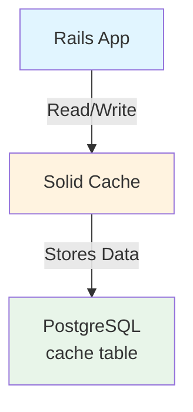

**Pros:**
- ✅ No additional infrastructure (uses existing PostgreSQL)
- ✅ Persistent storage (survives restarts)
- ✅ Simple setup (Rails 8 built-in)
- ✅ Shared across multiple app instances
- ✅ ACID transactions
- ✅ No memory limits

**Cons:**
- ❌ Slower than in-memory caches (2-5ms vs <1ms)
- ❌ Database overhead (uses connection pool)
- ❌ Limited by database performance
- ❌ Not optimized for cache workloads

**Best For:**
- Small to medium scale (< 1M users)
- When you already use PostgreSQL
- When simplicity is important
- Development and staging environments

#### Option 2: Redis

**Architecture:**

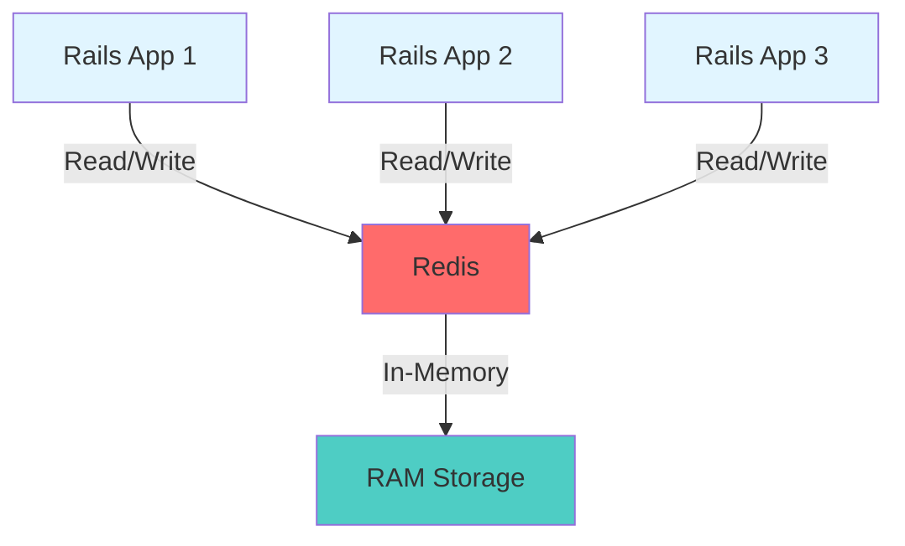

**Pros:**
- ✅ Extremely fast (<1ms reads/writes)
- ✅ Optimized for caching workloads
- ✅ Rich data structures (strings, lists, sets, hashes)
- ✅ Built-in expiration (TTL)
- ✅ Pub/Sub for cache invalidation
- ✅ Industry standard
- ✅ Horizontal scaling (Redis Cluster)

**Cons:**
- ❌ Requires separate server/instance
- ❌ Memory-only (data lost on restart, unless persistence enabled)
- ❌ Additional infrastructure to manage
- ❌ Memory costs (all data in RAM)
- ❌ Need persistence strategy (RDB/AOF)

**Performance:**

| Operation | Redis | Solid Cache |
|-----------|-------|-------------|
| **Read** | <1ms | 2-5ms |
| **Write** | <1ms | 2-5ms |
| **Throughput** | 100k+ ops/sec | 10k ops/sec |

**Best For:**
- High-traffic applications (100k+ users)
- When performance is critical
- When you need advanced features (pub/sub, Lua scripts)
- Production environments with dedicated infrastructure

#### Option 3: Memcached

**Architecture:**

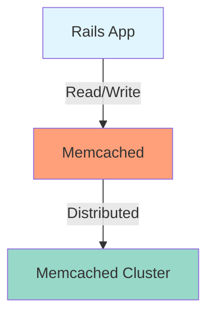

**Pros:**
- ✅ Very fast (<1ms)
- ✅ Simple key-value store
- ✅ Distributed (multiple servers)
- ✅ Mature and stable
- ✅ Low memory overhead

**Cons:**
- ❌ No persistence (data lost on restart)
- ❌ Limited data structures (strings only)
- ❌ No built-in replication
- ❌ Less feature-rich than Redis
- ❌ Declining popularity (Redis preferred)

**Best For:**
- Simple caching needs
- When you only need key-value storage
- Legacy systems already using Memcached

#### Option 4: Hybrid Approach

**Use Different Caches for Different Purposes:**

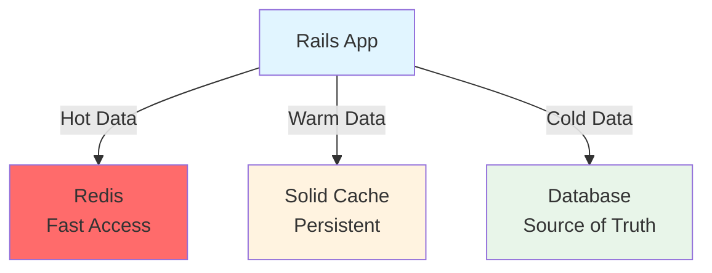

**Implementation:**

```ruby
# Multi-level caching
class CacheService
  def self.fetch(key, expires_in: 5.minutes, &block)
    # Level 1: Redis (fastest)
    value = Redis.current.get(key)
    return JSON.parse(value) if value

    # Level 2: Solid Cache (persistent)
    value = Rails.cache.read(key)
    if value
      # Warm up Redis
      Redis.current.setex(key, expires_in.to_i, value.to_json)
      return value
    end

    # Level 3: Database (source of truth)
    value = yield
    Rails.cache.write(key, value, expires_in: expires_in)
    Redis.current.setex(key, expires_in.to_i, value.to_json)
    value
  end
end
```

### Cache Invalidation Strategies

#### Strategy 1: Time-Based Expiration (TTL)

**Current Implementation:**

```ruby
Rails.cache.write(key, value, expires_in: 5.minutes)
```

**Pros:**
- ✅ Simple
- ✅ Automatic cleanup
- ✅ No invalidation logic needed

**Cons:**
- ❌ Stale data for up to TTL duration
- ❌ May serve outdated content

#### Strategy 2: Explicit Invalidation

```ruby
# On post creation
after_create :invalidate_feed_cache

def invalidate_feed_cache
  # Invalidate all user feeds that include this post
  followers.each do |follower|
    Rails.cache.delete("user_feed:#{follower.id}:*")
  end
end
```

**Pros:**
- ✅ Immediate freshness
- ✅ No stale data
- ✅ Granular control

**Cons:**
- ❌ More complex
- ❌ Risk of missed invalidations
- ❌ Can be expensive (many keys to delete)

#### Strategy 3: Version-Based Invalidation

```ruby
# Add version to cache key
cache_key = "user_feed:#{user_id}:#{user.feed_version}:#{cursor}"

# Increment version on changes
def update_feed_version
  increment!(:feed_version)
end
```

**Pros:**
- ✅ Automatic invalidation
- ✅ No key deletion needed
- ✅ Works well with TTL

**Cons:**
- ❌ Requires version tracking
- ❌ Slightly more complex

### Performance Comparison

| Cache | Read Latency | Write Latency | Throughput | Persistence | Complexity |
|-------|--------------|---------------|------------|-------------|------------|
| **Solid Cache** | 2-5ms | 2-5ms | 10k ops/sec | ✅ Yes | ⭐ Simple |
| **Redis** | <1ms | <1ms | 100k+ ops/sec | ⚠️ Optional | ⭐⭐ Medium |
| **Memcached** | <1ms | <1ms | 50k ops/sec | ❌ No | ⭐ Simple |
| **Hybrid** | <1ms* | <1ms* | 100k+ ops/sec | ✅ Yes | ⭐⭐⭐ Complex |

*For hot data in Redis

### Recommendations

**For Our Microblog:**

**Current Scale (< 100k users):**
✅ **Solid Cache is sufficient**

**Why:**
- Simple setup (no additional infrastructure)
- Good enough performance (2-5ms is acceptable)
- Persistent (survives restarts)
- Shared across instances (horizontal scaling)

**When to Migrate to Redis:**
- Traffic exceeds 10k requests/second
- Cache becomes bottleneck (>5ms latency)
- Need advanced features (pub/sub, Lua scripts)
- Have dedicated infrastructure budget

**Migration Path:**
1. Start with Solid Cache (current)
2. Monitor cache performance
3. Add Redis for hot data (hybrid)
4. Gradually migrate to Redis-only

---

## 5. Connection Pooling

### Overview

Database connections are expensive to create and maintain. Connection pooling reuses connections across requests, dramatically improving performance and resource utilization.

### The Problem Without Connection Pooling

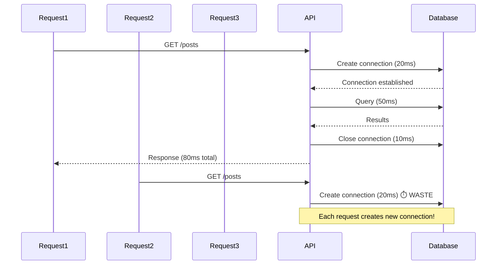

**Problems:**
- Connection overhead: 20-50ms per connection
- Resource waste: Each connection uses ~10MB RAM
- Limited scalability: PostgreSQL has connection limits (default: 100)
- Slow under load: Connection creation becomes bottleneck

### Connection Pooling Solution

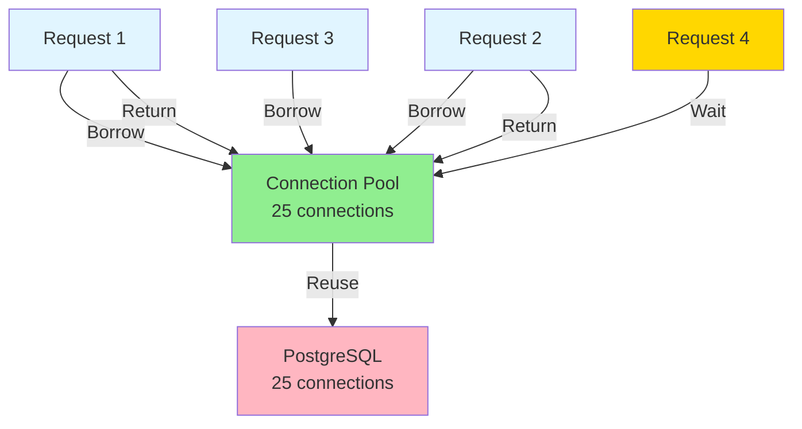

**How It Works:**

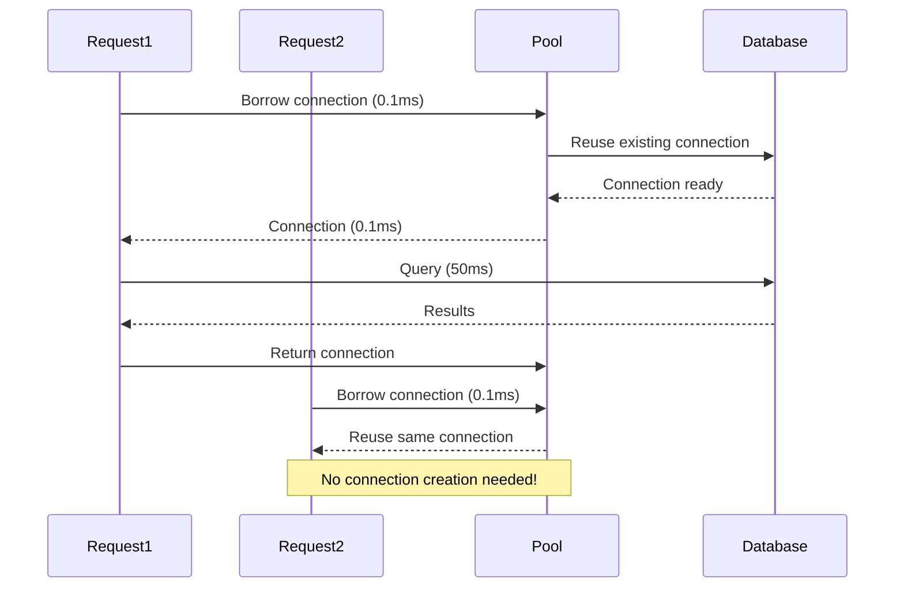

### Current Implementation

**Configuration:**

```yaml
# config/database.yml
default: &default
  adapter: postgresql
  pool: <%= ENV.fetch("RAILS_MAX_THREADS") { 25 } %>
  timeout: 5000
```

**How Rails Connection Pool Works:**

```ruby
# Rails automatically manages connection pool
# Each thread gets a connection from the pool

# Thread 1
ActiveRecord::Base.connection  # Gets connection from pool

# Thread 2 (concurrent request)
ActiveRecord::Base.connection  # Gets different connection from pool

# When thread finishes
# Connection is returned to pool (not closed)
```

**Pool Size Calculation:**

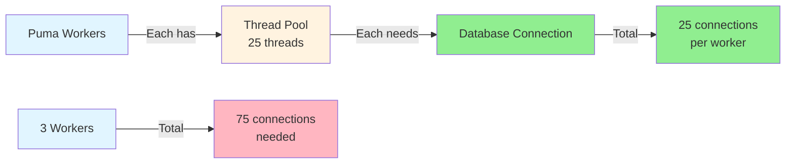

**Formula:**
```
Pool Size = Number of Workers × Threads per Worker

Example:
- 1 worker × 25 threads = 25 connections
- 3 workers × 25 threads = 75 connections
```

### Connection Pool Configuration

#### Optimal Pool Size

**Too Small:**
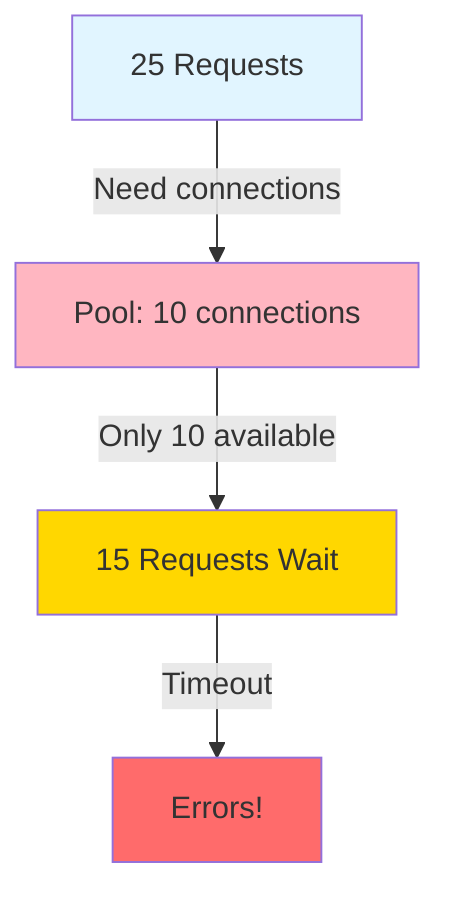

**Too Large:**
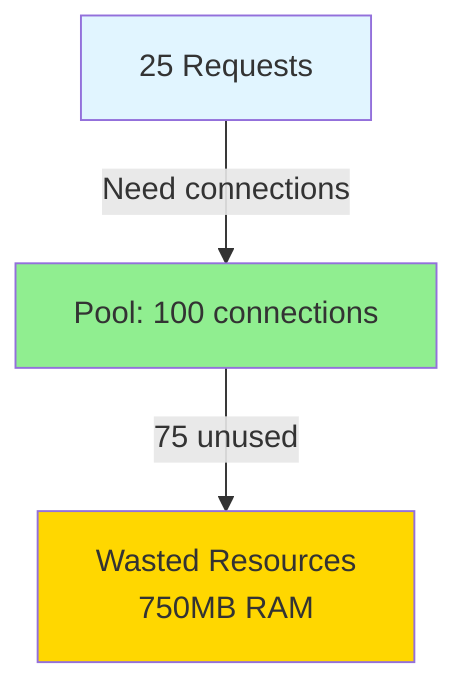

**Just Right:**
```mermaid
graph TB
    A[25 Requests] -->|Need connections| B[Pool: 25 connections]
    B -->|All used| C[Optimal Performance]

    style A fill:#E1F5FF
    style B fill:#90EE90
    style C fill:#90EE90
```

**Configuration:**

```yaml
# config/database.yml
production:
  adapter: postgresql
  pool: <%= ENV.fetch("RAILS_MAX_THREADS") { 25 } %>
  # Match pool size to thread count
  # If RAILS_MAX_THREADS=25, pool=25
```

#### Connection Timeout

**What It Does:**
- Maximum time to wait for a connection from the pool
- Prevents indefinite waiting

**Configuration:**

```yaml
production:
  adapter: postgresql
  pool: 25
  timeout: 5000  # 5 seconds
```

**Behavior:**

```mermaid
sequenceDiagram
    participant Request
    participant Pool
    participant Database

    Request->>Pool: Borrow connection
    alt Connection available
        Pool-->>Request: Connection (immediate)
    else Pool exhausted
        Request->>Pool: Wait for connection
        alt Connection freed within timeout
            Pool-->>Request: Connection
        else Timeout exceeded
            Pool-->>Request: TimeoutError
            Note over Request: Request fails!
        end
    end
```

#### Connection Checkout Timeout

**Rails-specific setting:**

```ruby
# config/initializers/active_record.rb
ActiveRecord::Base.establish_connection(
  pool: 25,
  checkout_timeout: 5  # seconds to wait for connection
)
```

### Monitoring Connection Pool

**Check Pool Status:**

```ruby
# In Rails console
ActiveRecord::Base.connection_pool.stat
# => {
#   size: 25,
#   connections: 10,      # Currently in use
#   busy: 10,              # Active queries
#   dead: 0,               # Dead connections
#   idle: 15,              # Available
#   waiting: 0,            # Requests waiting
#   checkout_timeout: 5
# }
```

**Monitor in Production:**

```ruby
# config/initializers/connection_pool_monitor.rb
if Rails.env.production?
  Thread.new do
    loop do
      stats = ActiveRecord::Base.connection_pool.stat
      if stats[:waiting] > 0
        Rails.logger.warn("Connection pool exhausted! Waiting: #{stats[:waiting]}")
      end
      sleep 10
    end
  end
end
```

### Performance Impact

**Without Connection Pooling:**
```
Request time: 20ms (create) + 50ms (query) + 10ms (close) = 80ms
Throughput: Limited by connection creation
```

**With Connection Pooling:**
```
Request time: 0.1ms (borrow) + 50ms (query) + 0.1ms (return) = 50.2ms
Throughput: 40% faster, handles more concurrent requests
```

### Best Practices

1. **Match Pool Size to Thread Count:**
   ```yaml
   pool: <%= ENV.fetch("RAILS_MAX_THREADS") { 25 } %>
   ```

2. **Monitor Pool Usage:**
   - Track `waiting` count
   - Alert if consistently > 0
   - Increase pool size if needed

3. **Set Appropriate Timeout:**
   - Too short: Premature failures
   - Too long: Requests hang
   - Recommended: 5 seconds

4. **Handle Pool Exhaustion:**
   ```ruby
   begin
     Post.find(id)
   rescue ActiveRecord::ConnectionTimeoutError
     # Retry or return error
     render json: { error: "Service temporarily unavailable" }, status: 503
   end
   ```

### Recommendations

**For Our Microblog:**

✅ **Current Configuration is Good:**
- Pool size: 25 (matches thread count)
- Timeout: 5 seconds
- Automatic connection management

**When to Adjust:**
- **Increase pool size** if:
  - `waiting` count > 0 frequently
  - High concurrent request rate
  - Multiple workers

- **Decrease pool size** if:
  - Database connection limit reached
  - Memory constraints
  - Low concurrent requests

**Formula:**
```
Optimal Pool Size = (Workers × Threads) + Buffer

Example:
- 1 worker × 25 threads = 25 connections
- Add 5 buffer = 30 connections (safe)
```

---

## 6. PgBouncer

### Overview

PgBouncer is a lightweight connection pooler for PostgreSQL. It sits between your application and database, managing connections more efficiently than Rails' built-in connection pool.

### Why PgBouncer is Important

**The Problem:**

```mermaid
graph TB
    A[3 Rails Servers] -->|Each has| B[25 connections]
    B -->|Total| C[75 connections<br/>to PostgreSQL]

    D[PostgreSQL] -->|Max connections| E[100 default]

    C -->|75/100 used| F[Only 25 available<br/>for other services]

    style A fill:#E1F5FF
    style B fill:#FFF3E0
    style C fill:#FFD700
    style D fill:#FFB6C1
    style E fill:#FF6B6B
    style F fill:#FFB6C1
```

**Issues:**
- Each Rails instance maintains its own connection pool
- Multiple instances = many database connections
- PostgreSQL connection limit (default: 100) can be exhausted
- Each connection uses ~10MB RAM
- Connection overhead: 20-50ms per connection

**The Solution: PgBouncer**

```mermaid
graph TB
    A[3 Rails Servers] -->|75 connections| B[PgBouncer<br/>Connection Pooler]
    B -->|25 connections| C[PostgreSQL]

    style A fill:#E1F5FF
    style B fill:#90EE90
    style C fill:#FFB6C1
```

**Benefits:**
- ✅ Fewer database connections (75 → 25)
- ✅ Connection reuse across servers
- ✅ Faster connection establishment (<1ms vs 20-50ms)
- ✅ Higher throughput
- ✅ Better resource utilization

### How PgBouncer Works

**Architecture:**

```mermaid
sequenceDiagram
    participant Rails1
    participant Rails2
    participant PgBouncer
    participant PostgreSQL

    Rails1->>PgBouncer: Request connection (0.1ms)
    PgBouncer->>PostgreSQL: Reuse existing connection
    PostgreSQL-->>PgBouncer: Connection ready
    PgBouncer-->>Rails1: Connection (0.1ms)
    Rails1->>PgBouncer: Query
    PgBouncer->>PostgreSQL: Execute query
    PostgreSQL-->>PgBouncer: Results
    PgBouncer-->>Rails1: Results
    Rails1->>PgBouncer: Return connection

    Note over PgBouncer: Connection returned to pool

    Rails2->>PgBouncer: Request connection (0.1ms)
    PgBouncer-->>Rails2: Reuse same connection
    Note over Rails2,PgBouncer: No new DB connection needed!
```

### Pooling Modes

#### Mode 1: Session Pooling

**How It Works:**
- One connection per client session
- Connection held for entire session duration
- Similar to direct PostgreSQL connection

**Pros:**
- ✅ All PostgreSQL features work
- ✅ Prepared statements work
- ✅ Transactions work normally

**Cons:**
- ❌ Less efficient (more connections needed)
- ❌ Doesn't solve connection limit problem

**Use Case:**
- When you need all PostgreSQL features
- Legacy applications
- Complex transaction requirements

#### Mode 2: Transaction Pooling (Recommended)

**How It Works:**
- Connection shared across transactions
- Connection returned to pool after each transaction
- Multiple clients share same connection

**Pros:**
- ✅ Maximum efficiency (fewest connections)
- ✅ Best for high-traffic applications
- ✅ Solves connection limit problem

**Cons:**
- ❌ Prepared statements don't work (must disable)
- ❌ Session-level features don't work
- ❌ Some PostgreSQL features limited

**Configuration:**

```ini
# pgbouncer.ini
[pgbouncer]
pool_mode = transaction
```

**Rails Configuration:**

```yaml
# config/database.yml
production:
  adapter: postgresql
  prepared_statements: false  # Required for transaction pooling
  pool: 25
```

#### Mode 3: Statement Pooling

**How It Works:**
- Connection shared per statement
- Most aggressive pooling
- Rarely used

**Pros:**
- ✅ Maximum connection reuse

**Cons:**
- ❌ Very limited PostgreSQL features
- ❌ Transactions don't work
- ❌ Not suitable for Rails

### PgBouncer Setup

#### Installation

**Ubuntu/Debian:**
```bash
sudo apt-get install pgbouncer
```

**macOS:**
```bash
brew install pgbouncer
```

**Docker:**
```yaml
# docker-compose.yml
services:
  pgbouncer:
    image: edoburu/pgbouncer:latest
    environment:
      DATABASES_HOST: db
      DATABASES_PORT: 5432
      DATABASES_USER: postgres
      DATABASES_PASSWORD: postgres
      DATABASES_DBNAME: microblog_development
      POOL_MODE: transaction
      MAX_CLIENT_CONN: 1000
      DEFAULT_POOL_SIZE: 25
    ports:
      - "6432:6432"
```

#### Configuration

**File: `/etc/pgbouncer/pgbouncer.ini`**

```ini
[databases]
microblog = host=localhost port=5432 dbname=microblog_production

[pgbouncer]
# Network settings
listen_addr = 127.0.0.1
listen_port = 6432

# Authentication
auth_type = md5
auth_file = /etc/pgbouncer/userlist.txt

# Pooling mode
pool_mode = transaction

# Connection limits
max_client_conn = 1000      # Max client connections
default_pool_size = 25      # Connections per database
reserve_pool_size = 5       # Reserved for admin

# Timeouts
server_idle_timeout = 600   # Close idle connections after 10min
server_connect_timeout = 15 # Timeout for connecting to PostgreSQL
query_timeout = 0           # No query timeout (0 = disabled)
```

**User List:**

**File: `/etc/pgbouncer/userlist.txt`**
```
"postgres" "md5hashedpassword"
```

**Generate MD5 hash:**
```bash
echo -n "passwordpostgres" | md5sum
```

#### Rails Configuration

**Update `config/database.yml`:**

```yaml
production:
  adapter: postgresql
  host: localhost          # PgBouncer address
  port: 6432               # PgBouncer port (not 5432)
  database: microblog_production
  username: postgres
  password: your_password
  pool: 25
  prepared_statements: false  # Required for transaction pooling
```

#### Starting PgBouncer

```bash
# Start service
sudo systemctl start pgbouncer

# Check status
sudo systemctl status pgbouncer

# View logs
sudo tail -f /var/log/pgbouncer/pgbouncer.log
```

### Performance Comparison

**Without PgBouncer:**

```
3 Rails servers × 25 connections = 75 database connections
Connection overhead: 20-50ms per connection
PostgreSQL connections: 75/100 (75% used)
```

**With PgBouncer:**

```
3 Rails servers × 25 connections = 75 client connections
PgBouncer → PostgreSQL: 25 connections (pooled)
Connection overhead: <1ms (reused)
PostgreSQL connections: 25/100 (25% used)
Improvement: 3x fewer DB connections, 20-50x faster connection
```

### Monitoring PgBouncer

**Connect to Admin Console:**

```bash
psql -h localhost -p 6432 -U postgres pgbouncer
```

**Useful Commands:**

```sql
-- Show pool statistics
SHOW POOLS;

-- Show client connections
SHOW CLIENTS;

-- Show server connections
SHOW SERVERS;

-- Show configuration
SHOW CONFIG;
```

**Example Output:**

```
 database   | pool_mode |    max_client_conn    | current_client_conn
------------+-----------+-----------------------+---------------------
 microblog  | transaction | 1000                | 45

 database   | user      | cl_active | cl_waiting | sv_active | sv_idle
------------+-----------+-----------+------------+-----------+----------
 microblog  | postgres  | 10        | 0          | 8         | 17
```

### Common Issues and Solutions

#### Issue 1: Prepared Statements Error

**Error:**
```
PG::InvalidSqlStatementName: ERROR: prepared statement "a1" does not exist
```

**Solution:**
```yaml
# config/database.yml
prepared_statements: false
```

#### Issue 2: Connection Limit Reached

**Error:**
```
FATAL: too many connections
```

**Solution:**
- Increase `max_client_conn` in pgbouncer.ini
- Increase PostgreSQL `max_connections`
- Reduce Rails connection pool size

#### Issue 3: Authentication Failures

**Error:**
```
FATAL: password authentication failed
```

**Solution:**
- Verify userlist.txt has correct MD5 hash
- Check auth_file path in pgbouncer.ini
- Ensure PostgreSQL user exists

### When to Use PgBouncer

**✅ Use PgBouncer When:**
- Multiple Rails servers/instances
- Approaching PostgreSQL connection limit
- High concurrent request rate
- Need to reduce database connections
- Want faster connection establishment

**❌ Don't Need PgBouncer When:**
- Single Rails server
- Low traffic (< 100 req/sec)
- Not hitting connection limits
- Simple setup preferred

### Recommendations

**For Our Microblog:**

**Current Situation:**
- Using horizontal scaling (multiple servers)
- Each server has 25 connections
- 3 servers = 75 connections to PostgreSQL

**✅ Recommended: Use PgBouncer**

**Why:**
- Reduces database connections (75 → 25)
- Faster connection establishment
- Better resource utilization
- Scales better with more servers

**Configuration:**
```ini
pool_mode = transaction
max_client_conn = 1000
default_pool_size = 25
```

**Rails Config:**
```yaml
prepared_statements: false  # Required!
pool: 25
host: localhost
port: 6432  # PgBouncer port
```

**Expected Benefits:**
- 3x fewer database connections
- 20-50x faster connection establishment
- Better scalability
- Lower memory usage

**Migration Path:**
1. Install and configure PgBouncer
2. Test with one server
3. Update Rails config (`prepared_statements: false`)
4. Deploy to all servers
5. Monitor connection usage

---

## Summary

### Optimization Priority

1. **✅ Pagination** - Implemented (cursor-based)
2. **⚠️ Asynchronous Logging** - Not implemented (recommended)
3. **⚠️ Payload Compression** - Not implemented (easy win)
4. **✅ Caching** - Implemented (Solid Cache)
5. **✅ Connection Pooling** - Configured (25 connections)
6. **⚠️ PgBouncer** - Not implemented (recommended for scaling)

### Quick Wins

**Immediate (Low Effort, High Impact):**
1. Enable HTTP compression (Rack::Deflater) - 5 minutes
2. Implement asynchronous logging - 1-2 hours
3. Configure PgBouncer - 2-3 hours

**Medium Term:**
1. Migrate to Redis caching (when traffic increases)
2. Add field selection API (reduce payload)
3. Implement Brotli compression

### Performance Impact Summary

| Optimization | Current | With Optimization | Improvement |
|--------------|---------|-------------------|-------------|
| **Pagination** | ✅ Implemented | 5-20ms | - |
| **Logging** | Synchronous | Asynchronous | 10-50ms saved |
| **Compression** | None | Gzip | 90% size reduction |
| **Caching** | Solid Cache | Solid Cache | 50-200ms → <1ms |
| **Connection Pool** | 25 | 25 | Optimal |
| **PgBouncer** | Direct | PgBouncer | 3x fewer connections |

### Final Recommendations

**For Current Scale (< 100k users):**
- ✅ Keep cursor-based pagination
- ✅ Keep Solid Cache
- ✅ Keep current connection pool (25)
- ⚠️ Add HTTP compression (easy win)
- ⚠️ Add asynchronous logging (important)
- ⚠️ Add PgBouncer (for scaling)

**For Future Scale (100k+ users):**
- Migrate to Redis caching
- Add PgBouncer (critical)
- Consider Brotli compression
- Implement field selection API
- Add connection pool monitoring

---

**Document Version:** 1.0
**Last Updated:** 2024
**Status:** Complete

