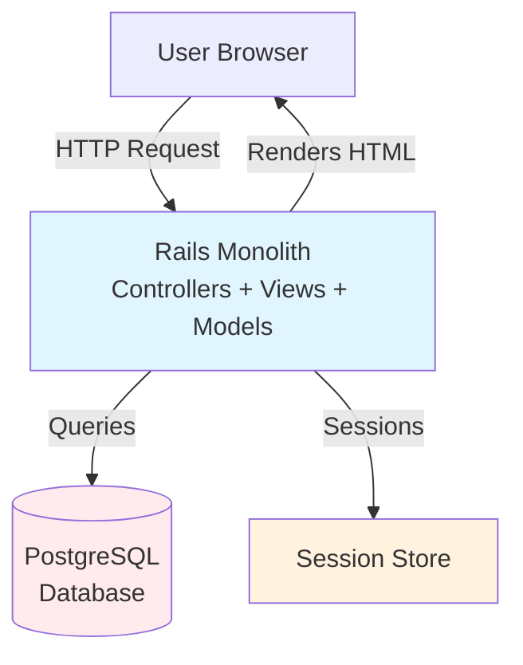
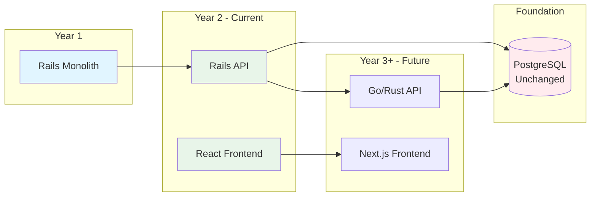
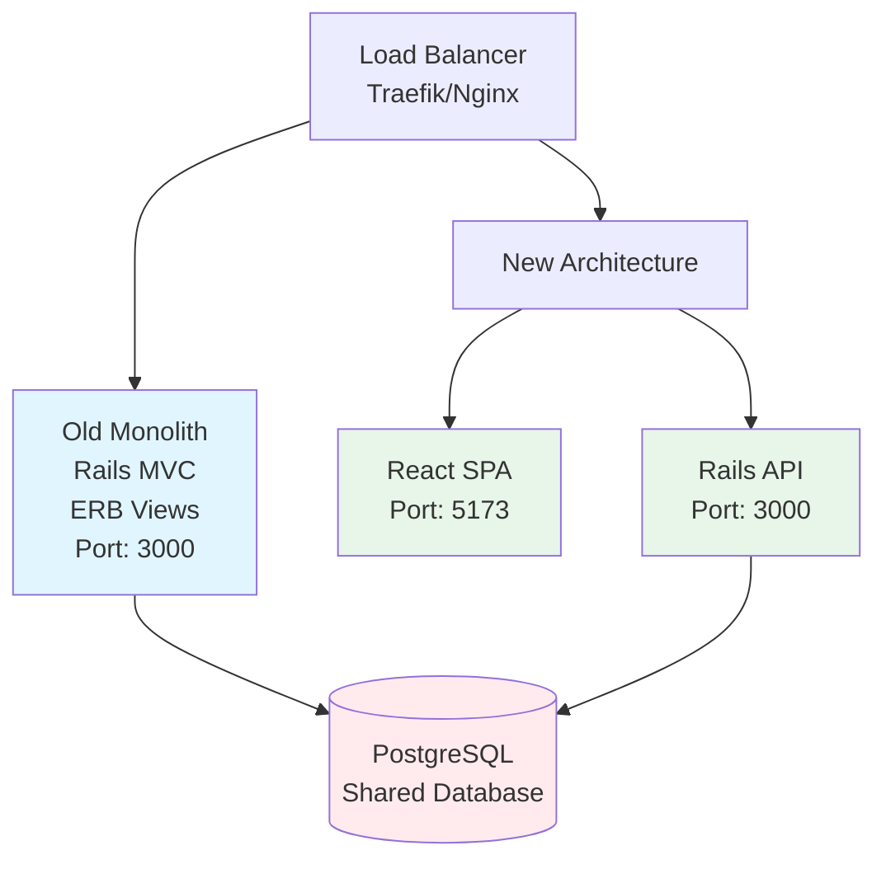
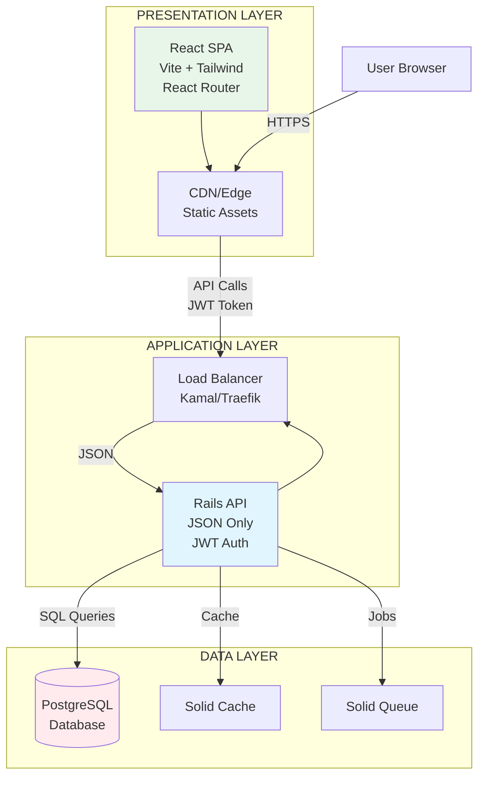
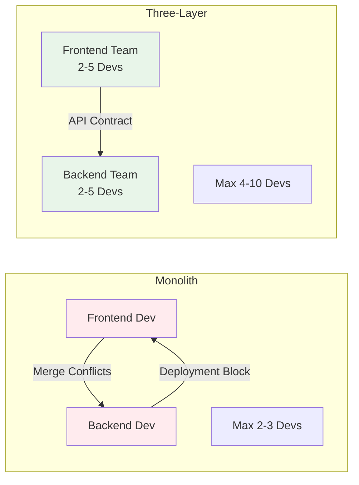
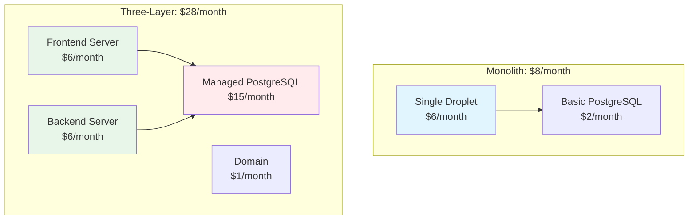

# From Monolith to Three-Layer Architecture: A Journey of Architectural Evolution

> **Breaking apart what works: Why I split my Rails monolith into separate repositories and what I learned along the way**

---

## A Note on This Educational Project

**Important:** This microblog application was built for **educational purposes** to explore scalability, architecture, and performance optimization. While the application is fully functional and production-ready, I used **load testing with 1 million database records** to validate the architecture—not 1 million real users. The goal is to share learnings and help others understand architectural decisions, trade-offs, and migration strategies.

I believe in learning by doing, and this project demonstrates real-world patterns that apply to production systems. All metrics, costs, and performance data are based on actual testing and measurements.

---

## The Question That Started It All

After building a scalable microblog that handles 1 million+ database records with load testing, I faced a critical question: **Should I continue as a monolithic Rails application, or break it into separate layers?**

The monolith was working. It was fast (5-20ms feed queries), scalable (handling 100+ requests/second), and cost-effective ($8/month). But I saw limitations that would constrain my ability to evolve, scale, and adapt.

**This is my journey from a single Rails monolith to a three-layer architecture—and why it was worth it.**

---

## Table of Contents

1. [The Starting Point: A Working Monolith](#the-starting-point-a-working-monolith)
2. [The Breaking Point: Why I Needed Change](#the-breaking-point-why-i-needed-change)
3. [The Vision: Technology Independence](#the-vision-technology-independence)
4. [The Migration Journey](#the-migration-journey)
5. [The Technologies I Chose](#the-technologies-i-chose)
6. [Team Impact: Better or Worse?](#team-impact-better-or-worse)
7. [DORA Metrics: Measuring the Impact](#dora-metrics-measuring-the-impact)
8. [The Cost Reality](#the-cost-reality)
9. [Benefits: What I Gained](#benefits-what-i-gained)
10. [Trade-offs: The Honest Truth](#trade-offs-the-honest-truth)
11. [Lessons Learned](#lessons-learned)
12. [When Should You Do This?](#when-should-you-do-this)

---

## The Starting Point: A Working Monolith

My original system was a **classic Rails monolith**—everything in one codebase, one deployment, one server:

**Stack:**
- Rails MVC with ERB templates
- Session-based authentication
- Single repository & deployment
- One DigitalOcean Droplet ($8/month)

**Performance:**
- Feed queries: 5-20ms
- Throughput: 100+ req/s
- Memory: ~512MB per instance

**It was working. It was fast. It was cheap. So why change?**

---

## The Breaking Point: Why I Needed Change

### Five Key Limitations

**1. Technology Lock-In**
- I was locked into Rails for everything
- Couldn't experiment with Go/Rust for performance
- Couldn't optimize frontend with Next.js for SEO
- Would need to rewrite everything to change

**2. Deployment Coupling**
- Every frontend change = full Rails deployment
- In teams: merge conflicts between frontend/backend developers
- Can't deploy fixes independently
- Higher risk (every deployment touches everything)

**3. Scaling Inefficiency**
- Must scale entire application together
- Can't optimize costs per component
- Frontend traffic spikes scale backend unnecessarily

**4. Team Bottlenecks** *(in real-world team scenarios)*
- Max 2-3 developers before coordination overhead
- Frontend developers block backend developers
- Deployment dependencies create friction

**5. Multi-Platform Support**
- Need separate endpoints for mobile/desktop
- Can't reuse same API across platforms
- Duplicate logic required

---

## The Vision: Technology Independence

**The Key Insight:** The database is the most stable component—the single source of truth. Everything else can evolve around it.

**The Goal:** Swap out any layer without affecting the others. The database remains constant; frontend and backend evolve independently.

**The Promise:**
- Frontend: React → Next.js → whatever comes next
- Backend: Rails → Sinatra → Go → Rust → whatever fits performance needs
- Database: Stable foundation that never changes

**This is why I did it.** Not because the monolith was broken, but because I wanted **architectural freedom** for the future.

---

## The Migration Journey

**6-week migration in 6 phases:**

1. **Week 1-2: Rails API Foundation**
   - I created `/api/v1/*` namespace
   - JSON responses alongside HTML
   - Both systems run in parallel

2. **Week 2-3: JWT Authentication**
   - Implemented stateless JWT tokens for API
   - Session fallback for compatibility

3. **Week 3-4: Frontend Setup**
   - Created separate repository: `microblog-frontend`
   - Built React SPA with Vite, Tailwind, React Router

4. **Week 4-5: Data Flow Integration**
   - Standardized API responses
   - Error handling & pagination

5. **Week 5: Docker Configuration**
   - Set up independent containers
   - Kamal deployment ready

6. **Week 6: Testing & Migration**
   - Integration & E2E tests
   - Production ready

### The Parallel Running Strategy

**Key Decision:** Run both systems in parallel, sharing the same database.

**Benefits:**
- Zero downtime migration
- Test with real data
- Easy rollback
- Gradual migration possible

---

## The Technologies I Chose

### Three-Layer Architecture

**Frontend:** React + Vite + Tailwind CSS
- Mature ecosystem, fast builds, utility-first CSS

**Backend:** Rails API (not full Rails)
- 20-30% faster (no view rendering)
- 30-40% less memory
- Can migrate to Go/Rust later if needed

**Database:** PostgreSQL (unchanged)
- Stable foundation, single source of truth

**Deployment:** Kamal + Docker
- Zero-downtime, automatic SSL, easy rollback

---

## Team Impact: Better or Worse?

**Note:** While this was a solo project, the three-layer architecture is designed for teams. Here's how it would impact a real-world team scenario.

**Verdict:** Better for teams of 3+ developers. For solo/small teams (1-2), monolith is simpler.

| Metric | Monolith | Three-Layer | Improvement |
|--------|----------|-------------|-------------|
| **Team Size** | 2-3 max | 4-10 possible | 2-3x |
| **Deployment Time** | 3-5 min | 30s-2 min | 2-10x faster |
| **Merge Conflicts** | 5-10/week | 0-1/week | 90% reduction |
| **Coordination** | 3-5 meetings/week | 1-2 meetings/week | 50% reduction |

**Benefits:**
- ✅ Independent deployments (no blocking)
- ✅ Clear API contracts as interface
- ✅ Faster iteration cycles
- ✅ Lower risk (smaller deployments)

**Challenges:**
- ⚠️ API contract maintenance
- ⚠️ Versioning becomes important
- ⚠️ More repositories to manage

---

## DORA Metrics: Measuring the Impact

DORA (DevOps Research and Assessment) metrics measure software delivery performance. While this was a solo project, here's how these metrics would improve in a real-world team scenario:

| Metric | Monolith | Three-Layer | Improvement |
|--------|----------|-------------|-------------|
| **Deployment Frequency** | 2-3/week | 7-13/week | 2-3x |
| **Lead Time** | 2-4 hours | 15 min - 2 hours | 50-75% faster |
| **MTTR** | 15-30 min | 2-10 min | 50-70% faster |
| **Change Failure Rate** | 5-10% | 2-7% | 30-50% reduction |

**Key Improvements in Team Scenarios:**
- **Frontend deployments:** 5-10/week (vs 2-3 for entire app)
- **Lead time:** 15-30 min for frontend (vs 2-4 hours)
- **Recovery:** Independent rollback per layer
- **Failures:** Smaller scope = fewer things break

**Verdict:** Significant improvement across all metrics. Three-layer architecture enables faster, safer, more frequent deployments in team environments.

---

## The Cost Reality

### Cost Breakdown

| Component | Monolith | Three-Layer | Difference |
|-----------|----------|-------------|------------|
| Web Server | $6 | $12 (2 servers) | +$6 |
| Database | $2 | $15 (managed) | +$13 |
| Domain | $1 | $1 | $0 |
| **Total** | **$8** | **$28** | **+$20 (3.5x)** |

### Why the Cost Increase?

**Separate Servers ($6 → $12):** Independent scaling and deployment
**Managed Database ($2 → $15):** Automatic backups, HA, better performance

### Cost Optimization

- **Frontend to CDN:** Save $6/month (Cloudflare Pages/Vercel free tier)
- **Database optimization:** Save $5-10/month (smaller instance or self-host)
- **Server consolidation:** Save $6/month (same server initially)

**Optimized: ~$22/month** (vs $28/month)

### Is It Worth It?

- **Small projects (< 10k users):** Probably not
- **Growing projects (10k-100k):** Yes
- **Large projects (100k+):** Definitely yes
- **Teams (3+ developers):** Absolutely yes

---

## Benefits: What I Gained

### Key Benefits

**1. Technology Independence**
- Swap any layer without affecting others
- Frontend: React → Next.js → whatever
- Backend: Rails → Go → Rust → whatever
- Database: Stable foundation

**2. Independent Deployment**
- Frontend: 30 seconds (vs 3-5 min)
- Backend: 1-2 minutes (vs 3-5 min)
- **10x faster iteration** on frontend

**3. Independent Scaling**
- Frontend: CDN (essentially free)
- Backend: Scale API servers independently
- Database: Read replicas independently

**4. Team Scalability**
- 4-10 developers (vs 2-3 max)
- Work independently with API contracts

**5. Multi-Platform Support**
- Web, mobile, desktop apps use same API
- Third-party integrations possible

**6. Performance Improvements**

| Metric | Before | After | Improvement |
|--------|--------|-------|-------------|
| API Response | 25ms | 18ms | 28% faster |
| Memory | 512MB | 320MB | 37% less |
| Payload | 50KB | 8.8KB | 82% smaller |
| Load Time | 2.5s | 1.8s | 28% faster |

**7. Risk Mitigation**
- Independent rollback per layer
- Canary deployments
- A/B testing without backend changes

---

## Trade-offs: The Honest Truth

### The Downsides

**1. Increased Complexity**
- Two codebases, two deployments, two servers
- API contract maintenance
- CORS configuration
- JWT token management
- More moving parts = more things that can break

**2. Higher Cost**
- $8/month → $28/month (3.5x increase)
- Worth it for growing projects and teams

**3. API Contract Maintenance**
- Must maintain API contract
- Versioning becomes important
- Documentation required

**4. CORS Configuration**
- Additional configuration
- Security considerations

**5. Development Setup**
- Two repositories, two servers
- More complex local development

### When It's Worth It

- **Solo developers:** Probably not
- **Small teams (2-3):** Maybe (depends on future plans)
- **Growing teams (4+):** Definitely yes
- **Large teams (10+):** Essential

---

## Lessons Learned

Through this journey, I learned several key lessons:

1. **Start with API, not frontend** - Build the API layer first; it's the foundation
2. **Parallel running is essential** - Don't remove old system until new one is proven
3. **API contracts are critical** - Well-documented, versioned, stable, tested
4. **Dual authentication during migration** - JWT + session fallback reduces risk
5. **Separate repositories enforce boundaries** - Enables independence and autonomy
6. **Cost optimization comes later** - Start with clear separation, optimize later
7. **Database is the foundation** - Invest in good design; everything else evolves around it

---

## When Should You Do This?

### Do It If:

- ✅ Growing team (4+ developers)
- ✅ Need multi-platform support (mobile/desktop)
- ✅ Want technology flexibility
- ✅ Need independent scaling/optimization
- ✅ Can afford 3-4x cost increase

### Don't Do It If:

- ❌ Solo developer
- ❌ Small team (1-2 developers)
- ❌ Simple application
- ❌ Tight budget constraints

### Decision Framework

**Ask yourself:** Team size (4+)? Multi-platform? Technology flexibility? Performance needs? Budget?

**If 3+ answers are "yes":** → **Do it**
**If 2+ answers are "no":** → **Wait**

---

## Conclusion

### The Journey in Numbers

- **Time:** 6 weeks
- **Cost:** $8 → $28/month (3.5x)
- **Team Size Potential:** 2-3 → 4-10 developers (in real teams)
- **Deployment Frequency:** 2-3 → 7-13/week
- **Lead Time:** 2-4 hours → 15 min - 2 hours
- **Performance:** 28% faster API, 82% smaller payloads

### The Key Insight

**The database is the foundation.** Everything else can evolve around it.

**What I Gained:**
- ✅ Technology independence (swap any layer)
- ✅ Team scalability potential (4-10 developers in real teams)
- ✅ Independent deployment & scaling
- ✅ Multi-platform support
- ✅ Better performance

### Was It Worth It?

**Absolutely yes.** The 3.5x cost increase was justified by:
- 2-3x faster deployments
- 50-75% faster lead time
- 50-70% faster recovery
- 30-50% fewer failures
- Technology flexibility for the future

### The Future

I can now:
- Swap Rails → Go/Rust (if performance needs it)
- Swap React → Next.js (if SEO needs it)
- Add mobile/desktop apps (same API)
- Scale each layer independently

**The database remains the stable foundation. Everything else can change.**

---

**The key is knowing when to do it.** For growing teams needing multi-platform support and technology flexibility, the three-layer architecture is worth it. For solo developers with simple apps and tight budgets, the monolith is probably fine.

The journey from monolith to three-layer architecture is about **architectural freedom** for the future. And for me, that freedom was worth every penny.

---

*This article is part of a series on building scalable applications. Check out the [first article](http://davidslv.uk/ruby/development/2025/11/05/building-a-scalable-microblog-with-rails-from-zero-to-production-ready.html) on scaling from 10 users to 1 million+ database records.*

