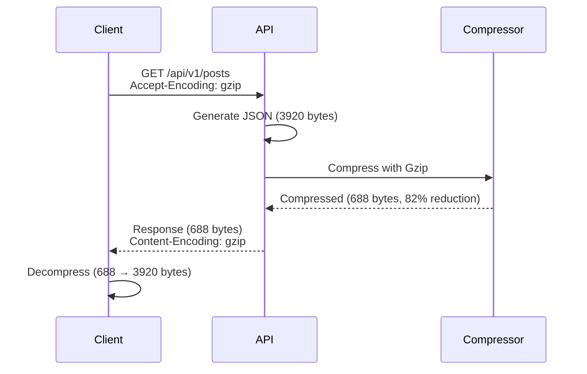
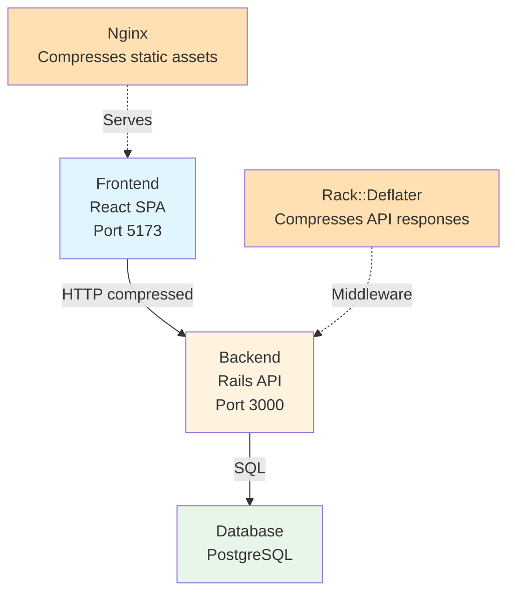

# HTTP Compression: The Simple Optimization That Saves Money

> **A practical guide to implementing HTTP compression in distributed applications, with real-world examples from the microblog ecosystem**

When you have a monolith application, you don't really need to think about HTTP compression. Your only external communication may be the database and some integrations—your whole system is glued together. But when you have applications built separately, you may be using HTTP request/response as the communication protocol between your applications.

In our case, we have a **three-layer architecture**:
- **Presentation Layer** (Frontend - React)
- **Application Layer** (Backend - Rails API)
- **Data Layer** (PostgreSQL)

This article shows you how to implement HTTP compression—one of the top API optimization recommendations because it's simple to implement and quite valuable. It will cost you a few hours of your time, but can save your business a lot of money.

---

## Table of Contents

1. [Why HTTP Compression Matters](#why-http-compression-matters)
2. [How HTTP Compression Works](#how-http-compression-works)
3. [Real-World Impact](#real-world-impact)
4. [Implementation in Microblog Ecosystem](#implementation-in-microblog-ecosystem)
5. [Backend Implementation (Rails)](#backend-implementation-rails)
6. [Standalone Ruby Implementation (Rack)](#standalone-ruby-implementation-rack)
7. [Frontend Implementation (Nginx)](#frontend-implementation-nginx)
8. [Verification and Testing](#verification-and-testing)
9. [Performance Results](#performance-results)
10. [Best Practices](#best-practices)

---

## Why HTTP Compression Matters

When your frontend and backend are separate applications, every API call transfers data over HTTP. Without compression, you're sending raw JSON, HTML, CSS, and JavaScript—which can be **very large**.

**Example:** A feed of 20 posts:
- Uncompressed JSON: **3,920 bytes**
- With Gzip compression: **688 bytes**
- **Savings: 82.4% reduction**

**Impact:**
- **80-90% bandwidth reduction** → Lower infrastructure costs
- **5-10x faster transfer times** on slow networks → Better mobile experience
- **Minimal CPU overhead** (5-10%) → Negligible performance cost

**Most valuable for:** Mobile users, high-traffic APIs, large JSON responses, and global applications.

---

## How HTTP Compression Works

### The Compression Flow



### How It Works

1. Client sends `Accept-Encoding: gzip` header
2. Server compresses response body using Gzip
3. Server adds `Content-Encoding: gzip` header
4. Compressed data is sent over network
5. Client automatically decompresses the response

### Compression Algorithms

**Gzip (Recommended)**
- ✅ 80-90% compression for JSON/text
- ✅ Low CPU overhead (5-10%)
- ✅ Supported by all modern browsers
- ✅ Built into most web servers

**Brotli** offers 85-95% compression but requires additional setup and has higher CPU overhead. For most applications, **Gzip is the sweet spot**.

---

## Real-World Impact

Testing the `/api/v1/posts` endpoint in our microblog application:

| Metric | Without Compression | With Compression | Improvement |
|--------|---------------------|------------------|-------------|
| **Response Size** | 3,920 bytes | 688 bytes | **82.4% reduction** |
| **Transfer Time (3G)** | ~0.08s | ~0.015s | **5.3x faster** |
| **Transfer Time (4G)** | ~0.04s | ~0.007s | **5.7x faster** |
| **Bandwidth Usage** | 3,920 bytes | 688 bytes | **82.4% savings** |

**Business Impact:** For 1 million requests/day, compression saves **3.02 GB/day** (1.1 TB/year), resulting in **82.4% reduction** in bandwidth and CDN costs.

---

## Implementation in Microblog Ecosystem

Our microblog uses a **three-layer architecture** with compression at two levels:



---

## Backend Implementation (Rails)

### Configuration File

**File: `config/initializers/compression.rb`**

```ruby
# HTTP Compression Configuration
# Enables Gzip compression for API responses to reduce bandwidth usage
#
# Benefits:
# - 80-90% reduction in response size
# - Faster transfer times, especially on mobile networks
# - Lower bandwidth costs
# - Better user experience

Rails.application.config.middleware.use Rack::Deflater, {
  # Only compress responses that meet these criteria:
  if: ->(env, status, headers, body) {
    # Only compress successful responses
    return false unless status == 200

    # Skip health check endpoint (small response, not worth compressing)
    return false if env['PATH_INFO'] == '/up'

    # Only compress API responses and compressible content types
    # Note: Rack::Deflater automatically skips very small responses (<860 bytes)
    # so we don't need to check Content-Length here (it may not be available yet)
    env['PATH_INFO'].start_with?('/api/') ||
      headers['Content-Type']&.include?('application/json') ||
      headers['Content-Type']&.include?('text/html') ||
      headers['Content-Type']&.include?('text/css') ||
      headers['Content-Type']&.include?('application/javascript') ||
      headers['Content-Type']&.include?('text/plain') ||
      headers['Content-Type']&.include?('application/xml')
  },
  # Include Vary header to indicate compression
  include: %w[
    application/json
    application/javascript
    text/css
    text/html
    text/plain
    text/xml
    application/xml
    application/xml+rss
  ]
}
```

### How It Works

- `Rack::Deflater` middleware compresses responses automatically
- Only compresses: status 200, API paths or compressible content types, responses >860 bytes
- Works transparently—no controller changes needed

**Compressed:** API endpoints returning >860 bytes (e.g., `/api/v1/posts`)
**Not Compressed:** Health checks (`/up`), small responses (<860 bytes), binary content

---

## Standalone Ruby Implementation (Rack)

If you're building a Ruby application without Rails, you can use Rack's `Deflater` middleware directly. This is useful for custom Rack applications or any Ruby web framework built on Rack.

### Basic Setup

**File: `config.ru` or `app.rb`**

```ruby
require 'rack'
require 'rack/deflater'

# Your application class (must respond to #call)
class MyApp
  def call(env)
    # Generate your response
    body = generate_json_response(env)

    [
      200,
      { 'Content-Type' => 'application/json' },
      [body]
    ]
  end

  private

  def generate_json_response(env)
    # Your JSON generation logic
    { posts: [...] }.to_json
  end
end

# Add compression middleware
use Rack::Deflater

# Run your app
run MyApp.new
```

### With Conditional Compression

For more control over what gets compressed:

```ruby
require 'rack'
require 'rack/deflater'

class MyApp
  def call(env)
    # Your application logic
    [200, { 'Content-Type' => 'application/json' }, [body]]
  end
end

# Conditional compression middleware
use Rack::Deflater, {
  if: ->(env, status, headers, body) {
    # Only compress successful API responses
    status == 200 &&
    env['PATH_INFO'].start_with?('/api/') &&
    headers['Content-Type']&.include?('application/json')
  },
  include: %w[
    application/json
    text/html
    text/css
    application/javascript
  ]
}

run MyApp.new
```

### Manual Compression (Without Rack::Deflater)

If you need more control or want to implement compression manually:

```ruby
require 'zlib'
require 'stringio'

class CompressionMiddleware
  COMPRESSIBLE_TYPES = %w[
    application/json
    text/html
    text/css
    application/javascript
  ].freeze

  MIN_SIZE = 860 # bytes

  def initialize(app)
    @app = app
  end

  def call(env)
    status, headers, body = @app.call(env)

    # Check if compression is requested
    return [status, headers, body] unless accepts_gzip?(env)

    # Check if response should be compressed
    return [status, headers, body] unless should_compress?(status, headers)

    # Collect body chunks
    full_body = body.each.to_a.join

    # Skip if too small
    return [status, headers, body] if full_body.bytesize < MIN_SIZE

    # Compress
    compressed = compress(full_body)

    # Update headers
    headers['Content-Encoding'] = 'gzip'
    headers['Vary'] = 'Accept-Encoding'
    headers['Content-Length'] = compressed.bytesize.to_s

    # Return compressed body
    [status, headers, [compressed]]
  end

  private

  def accepts_gzip?(env)
    env['HTTP_ACCEPT_ENCODING']&.include?('gzip')
  end

  def should_compress?(status, headers)
    status == 200 &&
    COMPRESSIBLE_TYPES.any? { |type| headers['Content-Type']&.include?(type) }
  end

  def compress(data)
    io = StringIO.new
    gz = Zlib::GzipWriter.new(io)
    gz.write(data)
    gz.close
    io.string
  end
end

# Usage
use CompressionMiddleware
run MyApp.new
```

### Testing Your Implementation

**File: `test_compression.rb`**

```ruby
require 'net/http'
require 'uri'

uri = URI('http://localhost:9292/api/posts')

# Request without compression
http = Net::HTTP.new(uri.host, uri.port)
request = Net::HTTP::Get.new(uri.path)
response = http.request(request)
uncompressed_size = response.body.bytesize

# Request with compression
request['Accept-Encoding'] = 'gzip'
response = http.request(request)
compressed_size = response['Content-Length']&.to_i || response.body.bytesize

puts "Uncompressed: #{uncompressed_size} bytes"
puts "Compressed: #{compressed_size} bytes"
puts "Reduction: #{((uncompressed_size - compressed_size) * 100.0 / uncompressed_size).round(1)}%"
puts "Compression enabled: #{response['Content-Encoding'] == 'gzip'}"
```

### Key Differences from Rails

1. **No automatic setup**: You must explicitly add `use Rack::Deflater`
2. **Manual configuration**: All options must be specified in the middleware call
3. **Application structure**: Your app must be a Rack-compatible object (responds to `#call`)
4. **No initializers**: Configuration goes in `config.ru` or your main application file

### Performance Considerations

- **Rack::Deflater** automatically skips responses <860 bytes
- Compression happens in memory, so large responses may use significant RAM
- For streaming responses, consider using `Rack::Deflater` with chunked encoding
- CPU overhead is the same as Rails: 5-10% for Gzip Level 6

---

## Frontend Implementation (Nginx)

### Configuration File

**File: `nginx.conf` (in frontend Docker container)**

```nginx
server {
    listen 80;
    server_name _;
    root /usr/share/nginx/html;
    index index.html;

    # Gzip compression for static assets and API responses
    gzip on;
    gzip_vary on;
    gzip_proxied any;
    gzip_comp_level 6;  # Balance between compression ratio and CPU usage
    gzip_min_length 1024;  # Only compress files larger than 1KB
    gzip_types
        text/plain
        text/css
        text/xml
        text/javascript
        application/json
        application/javascript
        application/x-javascript
        application/xml
        application/xml+rss
        application/rss+xml
        image/svg+xml
        font/truetype
        font/opentype
        application/vnd.ms-fontobject;
    gzip_disable "msie6";  # Disable for old IE

    # SPA routing - serve index.html for all routes
    location / {
        try_files $uri $uri/ /index.html;
    }

    # Cache static assets
    location ~* \.(js|css|png|jpg|jpeg|gif|ico|svg|woff|woff2|ttf|eot)$ {
        expires 1y;
        add_header Cache-Control "public, immutable";
    }
}
```

### How It Works

- `gzip on` enables compression
- `gzip_comp_level 6` balances compression ratio and CPU usage
- `gzip_min_length 1024` only compresses files >1KB
- `gzip_vary on` adds `Vary: Accept-Encoding` header

**Compressed:** JavaScript, CSS, HTML, JSON (if proxied), SVG, fonts
**Not Compressed:** Binary images (PNG, JPG, GIF), files <1KB, already compressed content

---

## Verification and Testing

### Quick Verification

**Using curl:**
```bash
curl -H "Accept-Encoding: gzip" -v http://localhost:3000/api/v1/posts 2>&1 | grep -i "content-encoding"
# Expected: < content-Encoding: gzip
```

**Using Browser DevTools:**
1. Open Network tab (F12)
2. Make request to `/api/v1/posts`
3. Check for `Content-Encoding: gzip` in response headers
4. Compare "Size" (uncompressed) vs "Transferred" (compressed)

**Using Test Script:**
```bash
# For Rails
cd microblog-backend
bin/rails runner script/test_compression.rb

# For standalone Ruby/Rack
ruby test_compression.rb
```

**Verification Checklist:**
- ✅ `Content-Encoding: gzip` in response headers
- ✅ `Vary: Accept-Encoding` in response headers
- ✅ Compressed size < uncompressed size (typically 80-90% reduction)

---

## Performance Results

### Compression Ratios

| Content Type | Typical Compression | Our Results |
|--------------|---------------------|-------------|
| **JSON** | 80-90% | **82.4%** ✅ |
| **HTML** | 70-85% | - |
| **CSS** | 60-80% | - |
| **JavaScript** | 60-75% | - |

**Why JSON compresses well:** Repetitive structure (repeated keys), whitespace, and similar patterns make it highly compressible.

### CPU Overhead

- **Gzip Level 6** (recommended): 5-10% CPU overhead
- **Gzip Level 9**: 10-15% CPU overhead
- **Brotli**: 8-15% CPU overhead

**Recommendation:** Use Gzip Level 6 for the best balance between compression ratio and CPU usage.

---

## Best Practices

1. **Enable Early**: Minimal setup (1-2 hours), immediate benefits, no code changes needed
2. **Compress Appropriate Content**: JSON, HTML, CSS, JavaScript, text. Skip already compressed content (images, videos) and small responses (<860 bytes)
3. **Use Level 6**: Balanced compression (80-90%) with low CPU overhead (5-10%)
4. **Monitor Metrics**: Compression ratio (target: 80-90% for JSON), CPU overhead (target: <10%), bandwidth usage
5. **Test on Real Networks**: Use 3G/4G throttling in DevTools, test from different locations
6. **Handle Edge Cases**: Small responses (<860 bytes) skip automatically, exclude health checks, combine with pagination for large responses

---

## Summary

### Key Takeaways

- **Simple to implement** (1-2 hours, no code changes needed)
- **Massive impact** (80-90% bandwidth reduction, 5-10x faster on slow networks)
- **Cost savings** (82.4% bandwidth reduction = significant infrastructure savings)
- **Minimal overhead** (5-10% CPU cost for 80-90% size reduction)

### Our Results

**Microblog Application:**
- ✅ **82.4% compression ratio** for JSON responses
- ✅ **5.3x faster** transfer times on 3G networks
- ✅ **82.4% bandwidth savings**
- ✅ **Zero code changes** in controllers
- ✅ **Minimal CPU overhead** (5-10%)

