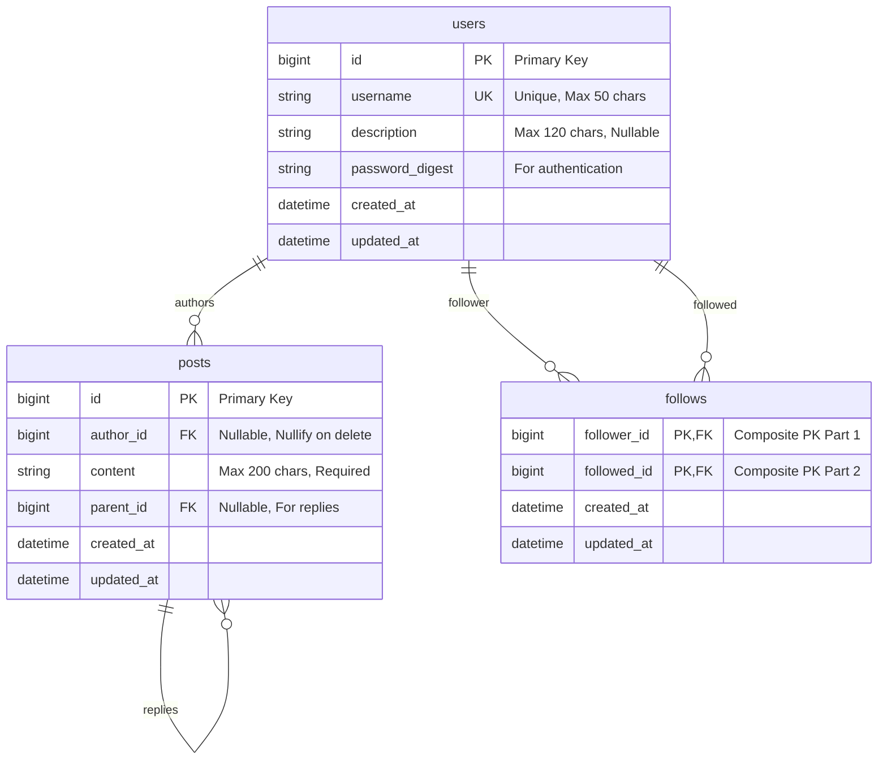

# Database Architecture Diagram

## Entity Relationship Diagram



## Relationship Details

### Users ↔ Posts (One-to-Many)
- **Direction**: One user can have many posts
- **Foreign Key**: `posts.author_id` → `users.id`
- **On Delete**: `CASCADE NULLIFY` - When user is deleted, posts remain but `author_id` becomes `NULL`
- **Business Rule**: Posts from deleted users are displayed as "Deleted User"

### Users ↔ Follows (Many-to-Many, Self-Referential)
- **Direction**: Users can follow other users (asymmetric/unidirectional)
- **Composite Primary Key**: `[follower_id, followed_id]`
- **Foreign Keys**:
  - `follows.follower_id` → `users.id` (CASCADE DELETE)
  - `follows.followed_id` → `users.id` (CASCADE DELETE)
- **Business Rules**:
  - User cannot follow themselves (validation required)
  - Following is one-way (asymmetric)
  - Unique constraint prevents duplicate follows

### Posts ↔ Posts (Self-Referential, One-to-Many)
- **Direction**: One post can have many replies
- **Foreign Key**: `posts.parent_id` → `posts.id`
- **On Delete**: `CASCADE NULLIFY` - When parent post is deleted, replies' `parent_id` becomes `NULL`
- **Business Rule**: Supports threaded conversations

## Indexes

### Users Table
- `index_users_on_username` (UNIQUE) - Fast username lookup and uniqueness check

### Posts Table
- `index_posts_on_author_id` - Fast queries for "posts by user"
- `index_posts_on_created_at` - Fast chronological sorting
- `index_posts_on_parent_id` - Fast queries for "replies to post"

### Follows Table
- `index_follows_on_follower_id_and_followed_id` (UNIQUE) - Composite index, enforces uniqueness
- `index_follows_on_followed_id` - Fast queries for "who follows this user?"

## Data Flow Examples

### Creating a Post
```
User (id: 1) creates Post
  → Post created with author_id: 1
  → Post appears in User's posts list
  → Post appears in User's followers' timelines
```

### Following a User
```
User A (id: 1) follows User B (id: 2)
  → Follow record created: follower_id: 1, followed_id: 2
  → User A's timeline now includes User B's posts
  → User B's follower count increases
```

### Replying to a Post
```
User (id: 2) replies to Post (id: 10)
  → New Post created with parent_id: 10
  → Reply appears under original post
  → Original post's reply count increases
```

### Deleting a User
```
User (id: 1) deletes account
  → All Follow records (where follower_id or followed_id = 1) are deleted (CASCADE)
  → All Posts where author_id = 1 have author_id set to NULL (NULLIFY)
  → Posts remain visible but show "Deleted User" as author
```

